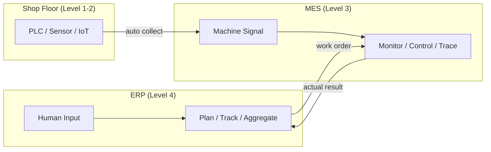
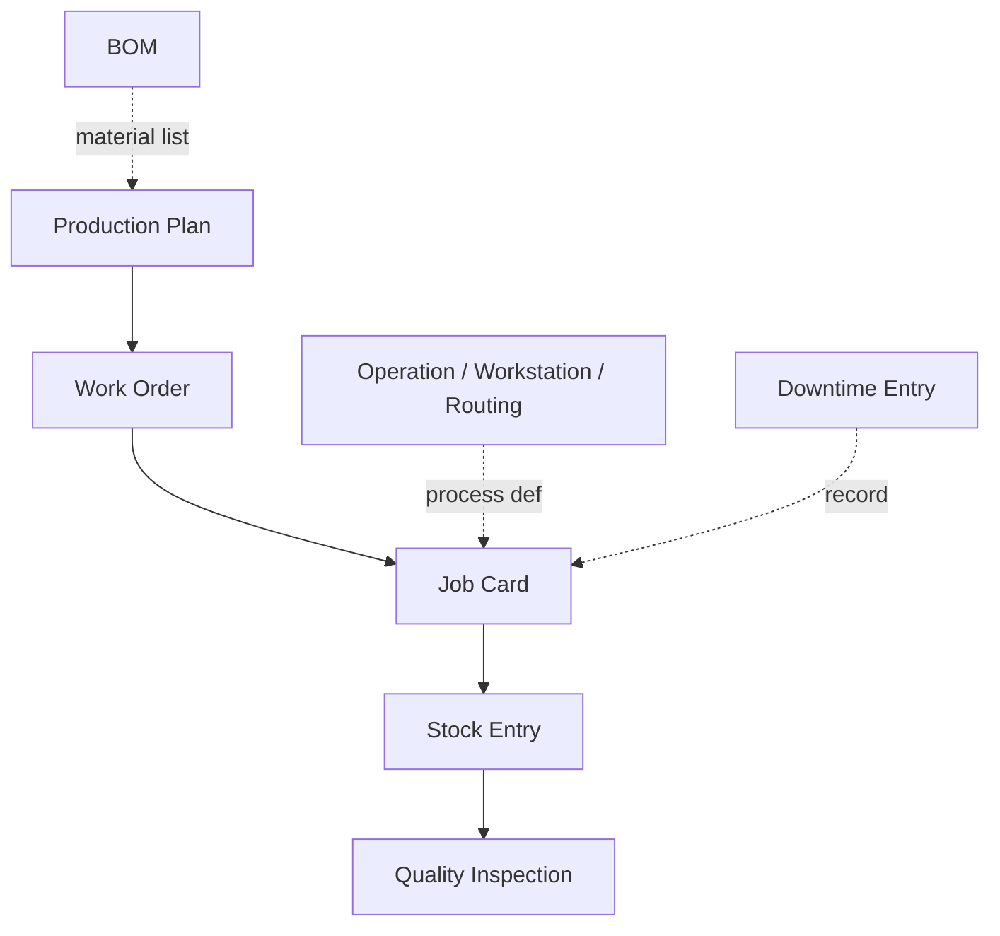
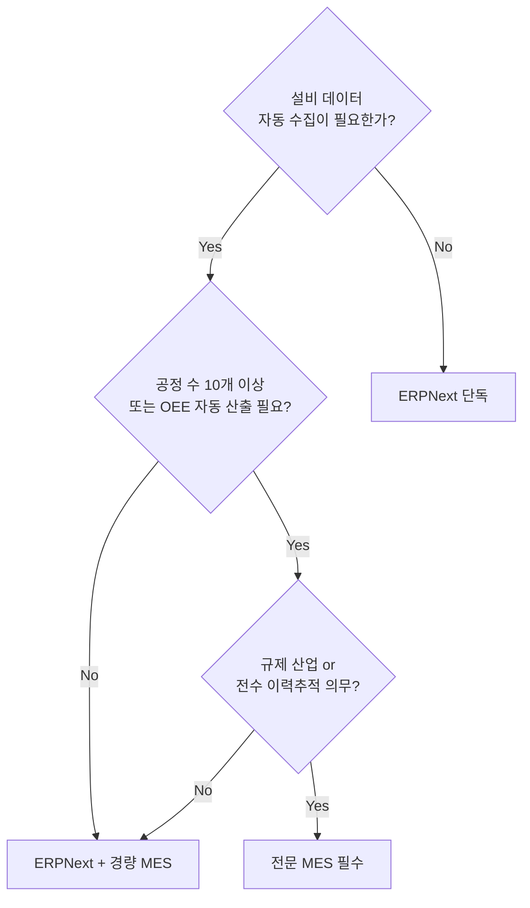
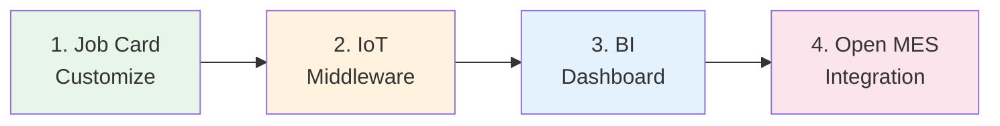
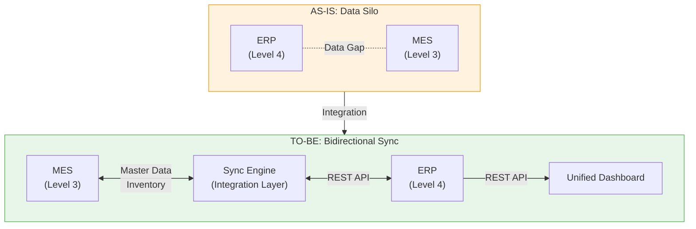

# ERP와 MES 개요

제조업에서 공정을 관리하는 소프트웨어는 크게 두 가지로 나뉜다.

- **ERP(Enterprise Resource Planning, 전사적 자원 관리)** — 구매, 판매, 재고, 제조, 회계 등 기업 전반의 업무를 통합 관리하는 시스템이다. 작업자가 시스템에 입력한 데이터를 기반으로 일/주 단위의 계획 수립과 실적 집계를 수행한다.
- **MES(Manufacturing Execution System, 제조 실행 시스템)** — 공장 현장에서 설비를 직접 제어하고 생산 공정 데이터를 수집하는 시스템이다. 설비와 센서에서 자동 수집된 데이터를 기반으로 초/분 단위의 실시간 현장 모니터링과 제어를 수행한다.

두 시스템의 가장 본질적인 차이는 **데이터 소스(Data Source)** 에 있다 — 사람이 입력한 데이터를 다루면 ERP, 설비가 보내는 신호를 다루면 MES이다. 이 문서는 이 구분을 출발점으로, 두 시스템의 역할과 한계를 비교하고, 도입 판단 기준을 제시한 뒤, 분리 운영 시 발생하는 구조적 문제와 그 해결 방향을 다룬다.

## 목차

- [1. 핵심 구분: 데이터 소스(Data Source)](#1-핵심-구분-데이터-소스data-source)
- [2. ERP 공정관리 — 수동 입력 데이터 기반](#2-erp-공정관리--수동-입력-데이터-기반)
- [3. MES 공정관리 — 설비 데이터 기반](#3-mes-공정관리--설비-데이터-기반)
- [4. 도입 판단](#4-도입-판단)
- [5. 분리 운영의 구조적 문제 (AS-IS)](#5-분리-운영의-구조적-문제-as-is)
- [6. 통합 해결 방향 (TO-BE)](#6-통합-해결-방향-to-be)
- [요약](#요약)

---

## 1. 핵심 구분: 데이터 소스(Data Source)

> ERP는 **사람이 입력한 데이터**로, MES는 **설비가 보내는 데이터**로 공정을 관리한다.



| 구분 | ERP 공정관리 | MES 공정관리 |
|:---:|---|---|
| **본질** | 수동 입력(Human-driven) 데이터 기반 | 설비(Machine-driven) 데이터 기반 |
| **관리 단위** | 일/주 단위 계획·실적 집계 | 초/분 단위 실시간 제어 |
| **핵심 질문** | "무엇을 얼마나 만들어라" | "지금 이 설비에서 무슨 일이 일어나는가" |
| **ISA-95 위치** | Level 4 (Business Planning) | Level 3 (Manufacturing Operations) |

---

## 2. ERP 공정관리 — 수동 입력 데이터 기반

ERP 제조 모듈(Manufacturing Module)은 **계획 → 지시 → 실적 집계 → 재고 반영** 흐름을 관리한다. 작업자가 데이터를 입력하고, 이를 기반으로 경영 판단 정보를 제공한다.

### 주요 기능 (ERPNext 기준)



| 기능 | 설명 |
|---|---|
| **BOM** (Bill of Materials) | 제품별 자재 구성, 다단계 BOM 관리 |
| **Production Plan** | 판매주문·수요예측 기반 생산계획 수립 |
| **Work Order** | 생산 지시 생성·추적·완료 처리 |
| **Operation / Workstation / Routing** | 공정·설비·라우팅(Routing) 정의 |
| **Job Card** | 공정별 작업 지시, 시작/종료 시간 기록 |
| **Stock Entry** | 자재 출고, 완제품 입고, 스크랩(Scrap) 처리 |
| **Quality Inspection** | 공정 중·입고·출고 검사 |
| **Downtime Entry** | 설비 비가동(Downtime) 사유 기록 |

### 한계

- 데이터 정확성·적시성(Timeliness)이 **작업자 입력에 의존**
- 실시간 설비 상태 파악 **불가**
- 초 단위 스케줄링, 설비 간 자동 연동은 **설계 범위 밖**

---

## 3. MES 공정관리 — 설비 데이터 기반

MES(Manufacturing Execution System)는 설비에서 자동 수집된 데이터로 **현장 공정을 실시간 모니터링·제어**한다.

### 설비 데이터(Machine-driven Data) 예시

- 설비 ON/OFF 상태 변화
- 사이클 완료 시 펄스 신호(Pulse Signal) → 생산 카운트
- 스핀들 RPM, 토크(Torque), 온도, 진동 등 센서 값
- 에러 코드(Error Code) 및 알람(Alarm) 발생
- 전력 소비량, 압력, 유량 등 공정 파라미터(Process Parameter)

### 주요 기능

| 기능 | 설명 |
|---|---|
| **실시간 설비 모니터링** | PLC/SCADA/IoT 센서 연동을 통한 설비 상태 실시간 파악 |
| **OEE 자동 산출** | 가동률(Availability) · 성능률(Performance) · 양품률(Quality)을 설비 신호 기반 자동 계산 |
| **공정 스케줄링** | 설비별 분 단위 디스패칭(Dispatching), 병목 공정 자동 재배치 |
| **공정 인터록(Interlock)** | 선행 공정 미완료 또는 검사 불합격 시 후속 공정 자동 차단 |
| **이력추적(Traceability)** | 로트·시리얼 단위 — 설비, 작업자, 파라미터 전수 기록 |
| **Andon / 현황판** | 현장 모니터에 실시간 생산현황, 불량률, 라인 상태 표시 |

---

## 4. 도입 판단

### 대시보드 판단 기준

> 사람이 입력한 실적을 보여주면 **ERP로 충분**하고, 설비가 보내는 신호를 보여줘야 하면 **MES가 필요**하다.

| 대시보드 내용 | 필요 시스템 | 데이터 성격 |
|---|:---:|---|
| 오늘 Work Order 완료·진행·불량 건수 | **ERP** | 집계성 현황 |
| 주간 생산 실적 대비 계획 달성률 | **ERP** | 계획 대비 실적 |
| 현재 3번 설비 가동/대기 상태 | **MES** | 실시간 설비 상태 |
| 현재 사이클타임 42초, 이 라인 OEE 78% | **MES** | 실시간 성능 지표 |

### 도입 의사결정 플로우



**ERPNext만으로 충분한 경우**
- 공정 수 5개 이하, 수동 또는 반자동 설비
- 설비 데이터 자동 수집 요구 없음
- 작업자가 Job Card로 시작/종료를 입력하는 것으로 충분
- 다품종 소량생산(High-mix Low-volume), 조립 위주 제조

**ERPNext + 경량 MES 연동이 필요한 경우**
- 공정 10개 내외, 일부 설비 데이터 수집 필요
- OEE 자동 산출이나 실시간 모니터링 요구 발생
- 바코드/QR 스캔 기반 공정 추적 고도화

**전문 MES 필수인 경우**
- 자동차, 반도체, 제약, 의료기기, 식품 등 **규제 산업**
- 설비 자동화율이 높고 실시간 제어 필수
- 로트·시리얼 단위 **전수 이력추적** 의무
- 공정 인터록(Interlock), 자동 디스패칭 등 현장 제어 로직 필요

---

## 5. 분리 운영의 구조적 문제 (AS-IS)

ERP와 MES는 계층이 다른 보완 관계이지만, **각각 도입하고 분리 운영**하면 계층 간 데이터가 단절되면서 구조적 문제가 발생한다.

### 데이터 단절(Data Silo)

두 시스템은 서로 다른 데이터베이스, API, 스키마, 비즈니스 로직을 사용한다. 별도 통합 없이는 데이터가 자동으로 흐르지 않는다.

```
┌──────────────────────────────────────────────────────┐
│  AS-IS: Data Silo between ERP and MES                │
│                                                      │
│  Level 4 ┌─────────────┐                             │
│  (ERP)   │  ERPNext     │  Human-driven data         │
│          │  - Work Order│  (Plan / Track / Aggregate) │
│          │  - Warehouse │                             │
│          │  - Item      │                             │
│          └──────┬───────┘                             │
│                 │  <== DATA GAP ==>                   │
│          ┌──────┴───────┐                             │
│  Level 3 │  MES4        │  Machine-driven data        │
│  (MES)   │  - Resource  │  (Monitor / Control)        │
│          │  - Buffer    │                             │
│          │  - Parts     │                             │
│          └──────────────┘                             │
│                                                      │
│  Different DB / API / Schema / Business Logic        │
└──────────────────────────────────────────────────────┘
```

- Level 4(ERP)와 Level 3(MES) 사이에 데이터 간극(Data Gap)이 존재
- 데이터베이스(DB), API, 스키마(Schema), 비즈니스 로직(Business Logic)이 모두 다름

### 주요 문제 유형

| # | 문제 유형 | 현상 | 영향 |
|---|----------|------|------|
| 1 | **재고 불일치**(Inventory Mismatch) | MES 버퍼(Buffer) 수량과 ERP 창고(Warehouse) 수량이 다름 | 자재 부족/과잉 → 생산 지연 또는 과다 재고 |
| 2 | **마스터 데이터 단절**(Master Data Silo) | MES에 신규 부품(Part)을 등록했으나 ERP에는 품목(Item)이 없음 | 수동 이중 입력 → 오류 발생, 데이터 불일치 |
| 3 | **가시성 분산**(Fragmented Visibility) | 생산 현황 파악을 위해 MES, ERP, 엑셀을 각각 확인 | 의사결정 지연, 현장-경영 간 정보 비대칭 |
| 4 | **통합 장벽**(Integration Barrier) | 두 시스템 연동에 전문 개발팀, 6~12개월, 높은 비용 필요 | 중소 제조기업의 통합 포기 → 데이터 단절 고착화 |

---

## 6. 통합 해결 방향 (TO-BE)

> AS-IS의 데이터 단절을 해소하려면 **ERP-MES 간 양방향 데이터 동기화**가 필요하다. 문제는 이 통합을 **누가, 어떻게** 구축하느냐이다.

### 전통적 접근과 그 한계

기존 DX(Digital Transformation) 패러다임에서 ERP-MES 통합은 다음 경로를 따른다.

```
┌─────────────────────────────────────────────────────┐
│  Traditional Integration (DX Approach)              │
│                                                     │
│  Domain Expert ──► Requirements ──► SI Vendor       │
│  (Knows WHAT)      Document        (Knows HOW)      │
│                                        │            │
│                      Translation       │ Custom Dev │
│                      Cost (High)       │ 6-12 months│
│                                        ▼            │
│                                  Integrated System  │
│                                  (Hard to maintain) │
└─────────────────────────────────────────────────────┘
```

- 도메인 전문가(Domain Expert)는 무엇이 필요한지 알지만 직접 구현할 수 없음
- 소프트웨어 개발자는 구현할 수 있지만 제조 도메인을 이해하지 못함
- 두 집단 사이의 **소통 비용(Translation Cost)** 이 프로젝트 지연과 비용 초과의 주요 원인

### 단계적 접근: 중간 대안

전면적 MES 도입이나 대규모 통합 프로젝트 이전에, **단계적 접근**으로 점진적 연동이 가능하다.



| 단계 | 방법 | 설명 |
|:---:|---|---|
| 1 | **Job Card 커스터마이징** | 바코드/QR 스캔으로 시작·종료 기록 자동화, 커스텀 필드로 공정 파라미터 추가 |
| 2 | **IoT 미들웨어(Middleware) 연동** | Node-RED, MQTT 브로커로 설비 데이터 수집 → ERPNext API로 주기 전송 |
| 3 | **BI 툴 연동** | Grafana, Metabase를 ERPNext DB에 연결하여 생산현황 대시보드 구축 |
| 4 | **오픈소스 MES 연동** | OpenMES 등과 ERPNext를 REST API로 연동 |

다만, 각 단계마다 **기술 구현 역량**이 병목이 된다는 점은 전통적 접근과 동일하다.

### TO-BE: 양방향 동기화 + AI 기반 개발

AX(AI Transformation) 패러다임은 이 병목을 근본적으로 해소한다. 데이터 단절의 4가지 문제 각각에 대한 해결 방향은 다음과 같다.

| # | AS-IS 문제 | TO-BE 해결 방향 | 핵심 메커니즘 |
|---|-----------|----------------|-------------|
| 1 | 재고 불일치 | MES 버퍼 → ERP 창고 **자동 동기화** | 폴링 서비스(Polling, 30~60초 주기) |
| 2 | 마스터 데이터 단절 | MES ↔ ERP **양방향 마스터 동기화** | 엔티티 매퍼(Mapper) + ID 매핑(JSON) |
| 3 | 가시성 분산 | 양쪽 데이터를 통합하는 **단일 대시보드** | ERP REST API + MES DB 조회 |
| 4 | 통합 장벽 | 도메인 전문가 + **AI 도구**로 직접 구축 | 생성형 AI 코딩 + MCP 서버 |



### DX와 AX의 비교

| 관점 | 전통적 통합 (DX) | AI 기반 통합 (AX) |
|------|-----------------|------------------|
| **구현 주체** | 전문 개발팀 / SI 업체 | 도메인 전문가 + AI 도구 |
| **DB 스키마 분석** | DBA가 수동으로 매핑 설계 | AI가 양쪽 스키마를 분석하여 매퍼 자동 생성 |
| **동기화 로직** | 백엔드 개발자가 ETL 파이프라인 구축 | AI가 동기화 엔진 코드 생성 |
| **대시보드** | 프론트엔드 개발자가 수개월 개발 | AI 파이프라인으로 설계부터 구현까지 수일 |
| **소통 비용** | 도메인 전문가 ↔ 개발자 간 번역 필요 | 도메인 전문가가 AI에게 직접 지시 |

> **핵심 통찰:** ERP-MES 통합의 본질적 어려움은 기술 자체가 아니라, **제조 도메인 지식과 소프트웨어 구현 역량 사이의 간극**이었다. 생성형 AI 도구는 이 간극을 메워, 도메인 전문가가 직접 통합 시스템을 구축할 수 있는 환경을 만든다.

---

## 요약

> **설비 데이터 기반 공정관리가 필요하면 MES, 수동 입력 데이터 기반 공정관리로 충분하면 ERP 제조모듈로 시작한다.**

ERP와 MES는 대립 관계가 아니라 **계층이 다른 보완 관계**다. 그러나 분리 운영 시 데이터 단절(Data Silo)이 발생하므로, 궁극적으로는 **양방향 동기화를 통한 통합**이 필요하다.

| | ERP | MES | 통합 (Integration) |
|---|---|---|---|
| **관점** | 경영(Business) | 현장(Shop Floor) | 데이터 흐름(Data Flow) |
| **역할** | 계획과 실적 관리 | 설비와 공정 실시간 제어 | 양쪽 데이터 동기화 |
| **전략** | 먼저 도입 | 설비 데이터 요구 시 점진 연동 | AI 도구로 통합 장벽 해소 |

현장 자동화 수준이 높지 않다면 **ERP만으로 시작**하고, 설비 데이터 활용 요구가 생길 때 **MES를 점진적으로 연동**하는 것이 가장 현실적인 접근이다. 이때 AI 기반 개발 방법론(AX)을 활용하면, 전문 개발팀 없이도 도메인 전문가가 직접 통합을 구축할 수 있다.
