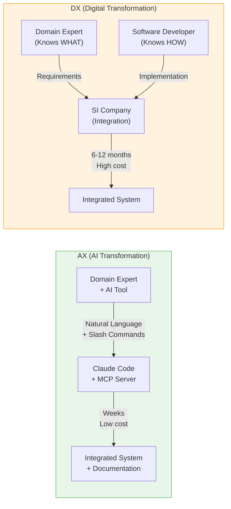
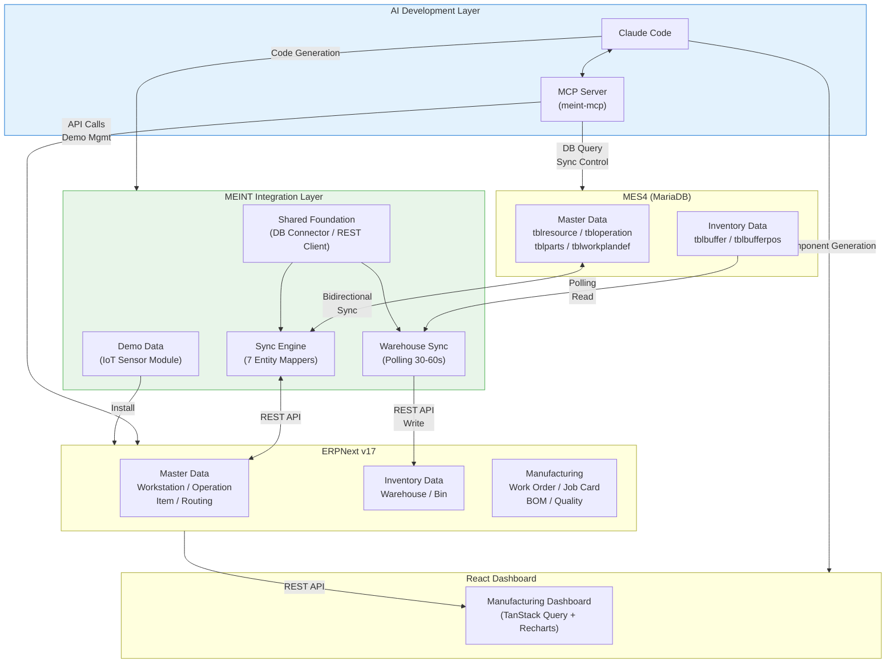
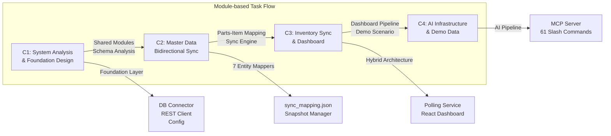

## MEINT Project Scenario

### 목차

- [1. 개요](#1-개요)
- [2. 제조 AX의 배경: DX에서 AX로](#2-제조-ax의-배경-dx에서-ax로)
  - [DX(Digital Transformation)의 한계](#dxdigital-transformation의-한계)
  - [AX(AI Transformation): 생성형 AI가 바꾸는 게임의 규칙](#axai-transformation-생성형-ai가-바꾸는-게임의-규칙)
  - [MEINT: 제조 AX의 실증 사례](#meint-제조-ax의-실증-사례)
- [3. 상위 시나리오 (Main Scenario)](#3-상위-시나리오-main-scenario)
- [4. 모듈별 과제 구성 (Modules Overview)](#4-모듈별-과제-구성-modules-overview)
- [5. 시나리오 세부 예시](#5-시나리오-세부-예시)
- [6. 기술 스택 및 장비 구성](#6-기술-스택-및-장비-구성)
- [7. 시각화 다이어그램](#7-시각화-다이어그램)
- [8. 평가 방향 및 핵심 역량](#8-평가-방향-및-핵심-역량)
- [9. 결론](#9-결론)

---

### 1. 개요

MEINT(MES-ERP Integration) 프로젝트 시나리오는 **ERP-MES 분리 운영으로 인한 데이터 단절(Data Silo)** 을 AI 기반 개발 방법론(AX)으로 해소하는 것을 중심 주제로 설계된다. 참가자는 Festo MES4(공장 현장 계층)와 ERPNext(경영 관리 계층) 사이의 양방향 데이터 동기화, 실시간 재고 모니터링, 통합 대시보드, 그리고 이 전체를 구축·운영하는 AI 개발 인프라까지 완성해야 한다.

본 시나리오는 ERP와 MES의 역할과 한계를 출발점으로, 분리 운영 시 발생하는 구조적 문제(AS-IS)를 정의하고, AI 기반 통합(TO-BE)을 해결 방향으로 제시한다. MEINT 프로젝트의 전체 산출물이 이 시나리오의 **기대 결과물**에 해당한다.

---

### 2. 제조 AX의 배경: DX에서 AX로

#### DX(Digital Transformation)의 한계

지난 10여 년간 제조업의 화두는 **디지털 전환(DX, Digital Transformation)** 이었다. MES, ERP, IoT, 클라우드 등의 시스템을 도입하여 공장을 디지털화하는 것이 목표였다. 그러나 많은 기업이 DX에서 실질적 성과를 거두지 못한 이유가 있다.

| DX의 과제 | 현실적 장벽 |
|-----------|------------|
| MES-ERP 통합 | SI 업체 의존, 높은 비용, 긴 개발 기간 |
| 데이터 시각화 대시보드 | 프론트엔드 전문 인력 부족 |
| 시스템 간 데이터 동기화 | 이기종 DB 스키마 이해 + 매핑 로직 작성에 전문성 필요 |
| 문서화 및 지식 전이 | 개발 후 문서화 누락, 담당자 퇴사 시 지식 유실 |

결국 DX의 가장 큰 병목은 **"기술 구현 역량"** 이었다. 제조 도메인 전문가는 무엇이 필요한지 알지만(WHAT) 직접 구현할 수 없고, 소프트웨어 개발자는 구현할 수 있지만(HOW) 제조 도메인을 모른다. 이 **WHAT과 HOW 사이의 간극**이 DX의 본질적 한계이다.

#### AX(AI Transformation): 생성형 AI가 바꾸는 게임의 규칙

**AX(AI Transformation)** 는 DX의 다음 단계로, **AI가 전환의 핵심 동력**이 되는 패러다임이다. 특히 생성형 AI 코딩 도구의 등장은 위의 장벽을 근본적으로 허물고 있다.



| 관점 | DX 패러다임 | AX 패러다임 |
|------|------------|------------|
| **구현 주체** | 전문 개발팀 / SI 업체 | 도메인 전문가 + AI 도구 |
| **개발 방식** | 요구사항 → 설계 → 코딩 → 테스트 (폭포수/애자일) | 자연어 지시 → AI 코드 생성 → 검증 → 반복 |
| **소통 비용** | 도메인 전문가 ↔ 개발자 간 번역 필요 | 도메인 전문가가 AI에게 직접 지시 |
| **문서화** | 개발 후 별도 작성 (종종 누락) | AI가 코드와 문서를 동시 생성 |
| **유지보수** | 원 개발자/업체 의존 | AI 도구로 누구나 코드 이해 및 수정 가능 |

#### MEINT: 제조 AX의 실증 사례

MEINT 프로젝트는 이 AX 패러다임을 **실제로 적용한 사례**이다.

- **동기화 엔진**: MES4의 DB 스키마를 Claude Code가 분석하고, ERPNext DocType과의 매핑 로직을 생성
- **React 대시보드**: BI 메트릭 디스커버리 → IA 설계 → 가이드라인 생성 → 프로젝트 구현까지 슬래시 명령 파이프라인으로 진행
- **데모 데이터**: IoT 센서 모듈 제조 시나리오를 AI와 협업하여 설계하고 JSON 데이터 자동 생성
- **문서**: 강의 노트, 슬라이드, 튜토리얼 모두 AI 문서 변환 명령(`/rewrite-doc:*`)으로 생성

> MEINT에서 생성형 AI는 "보조 도구"가 아니라 **"핵심 개발 방법론"** 이다. 프로젝트의 거의 모든 산출물이 AI와의 협업으로 만들어졌고, 이 워크플로우 자체가 MCP 서버와 슬래시 명령으로 체계화되어 **재현 가능**하다.

---

### 3. 상위 시나리오 (Main Scenario)

**주제:** ERP-MES 데이터 단절 해소를 위한 AI 기반 통합 시스템 구축

**시나리오 요약:**

한 중소 제조기업이 공장 현장에는 Festo MES4를, 경영 관리에는 더존 iCUBE ERP를 각각 도입하여 카메라(일반 모델/프로 모델, 각 색상 4종)를 생산 중이다. 그러나 iCUBE ERP는 소스코드 비공개, REST API 미제공, 벤더 종속(Vendor Lock-in) 구조의 **폐쇄적 시스템**으로, MES4와의 프로그래밍 방식 연동이 원천적으로 불가능하다. 이로 인해 작업자는 iCUBE ERP에서 작업지시를 확정한 뒤, MES4에 별도로 SQL 쿼리를 실행하고, SSMS·HeidiSQL·CIROS를 각각 수동 조작하는 **다중 시스템 수작업** 방식으로 생산을 운영하고 있다. 시스템 간 연동 부재로 인해 Power Automate 472개 Step의 RPA 스크립트를 만들어 수동 작업을 대체하는 우회책까지 동원되었으나, 이는 근본적 해결이 아닌 임시 방편에 불과하다.

이 프로젝트는 폐쇄적 iCUBE ERP를 **오픈소스 ERP(ERPNext)로 전환**하고, **도메인 전문가 + 생성형 AI 도구(Claude Code + MCP 서버)** 조합으로 MES4-ERPNext 양방향 통합을 직접 구축하여 데이터 단절을 해소하는 것을 목표로 한다.

```
┌──────────────────────────────────────────────────────────────┐
│  AS-IS: Manual Multi-System Operation (Team 2 Actual)        │
│                                                              │
│  ┌───────────────────┐    ┌───────────────┐                  │
│  │ iCUBE ERP (Douzone)│    │ SSMS / HeidiSQL│                 │
│  │ - Work Order only  │    │ - Direct DB    │                 │
│  │ - Closed API       │    │   access       │                 │
│  │ - Vendor Lock-in   │    └───────┬───────┘                  │
│  │ - No REST / Webhook│            │                          │
│  └────────┬──────────┘             │                          │
│           │ (manual)               │ (SQL query)              │
│           ▼                        ▼                          │
│  ┌────────────────────────────────────────────┐              │
│  │           Operator (Manual Hub)             │              │
│  │  "Each system must be operated separately"  │              │
│  └────────────────────────────────────────────┘              │
│           │ (manual)               │ (manual)                 │
│           ▼                        ▼                          │
│  ┌───────────────────┐    ┌───────────────────┐              │
│  │ MES4               │    │ CIROS / Fleet Mgr  │             │
│  │ - Production Plan  │    │ - Simulation       │             │
│  │ - Process Control  │    │ - Digital Twin     │             │
│  │ - Buffer / Parts   │    │ - AGV Control      │             │
│  └───────────────────┘    └───────────────────┘              │
│                                                              │
│  No API between systems => RPA workaround (472 Steps)        │
└──────────────────────────────────────────────────────────────┘
```

- iCUBE ERP(더존)는 API가 없는 폐쇄적 시스템으로, 프로그래밍 방식의 외부 연동이 불가
- 작업자(Operator)가 4개 이상의 시스템을 각각 수동으로 개별 조작하는 구조
- 시스템 간 자동 연동이 없어 Power Automate RPA(472개 Step)로 우회

**AS-IS 문제 정의:**

이 문제들은 단순한 운영 비효율이 아니라, 기존 **DX 패러다임의 구조적 한계**를 보여준다. 도메인 전문가는 무엇이 필요한지 알지만(WHAT) 직접 시스템을 통합할 수 없고, 폐쇄적 ERP는 외부 연동 자체를 차단한다. WHAT과 HOW 사이의 간극이 해소되지 않는 한, 수작업과 우회책은 반복될 수밖에 없다.

| # | 문제 유형 | 현상 (2조 실제 사례) | 영향 |
|---|----------|---------------------|------|
| 1 | **수작업 의존**(Manual Operation) | iCUBE ERP 작업지시 → MES4 주문설정 → SQL 버퍼 초기화를 각각 수동 수행 | 절차 복잡, 작업자 피로·실수, 생산 지연 |
| 2 | **시스템 간 데이터 단절**(Data Silo) | iCUBE 작업지시와 MES4 주문이 자동 연동 안 됨, DB가 별도 관리 | 이중 입력, 데이터 불일치 |
| 3 | **가시성 분산**(Fragmented Visibility) | iCUBE, MES4, SSMS, CIROS를 각각 확인해야 생산 현황 파악 가능 | 의사결정 지연, 현장-경영 간 정보 비대칭 |
| 4 | **폐쇄적 ERP**(Closed ERP System) | iCUBE에 API 없음, 프로그래밍 연동 불가, 벤더 종속(Vendor Lock-in) | 통합 자체가 원천 차단, 커스터마이징 불가 |
| 5 | **우회적 자동화**(RPA Workaround) | Power Automate로 472개 Step의 UI 자동화 스크립트 구성 | 근본 해결 아닌 우회, 취약·유지보수 어려움 |

**iCUBE ERP의 구조적 한계:**

위 문제의 근본 원인은 iCUBE ERP(더존)의 폐쇄적 아키텍처에 있다. 이것이 TO-BE에서 오픈소스 ERP(ERPNext)로 전환하는 핵심 동기이다.

| 한계 | 설명 |
|------|------|
| **소스코드 비공개** | 내부 구조 접근 불가, 독자적 확장·수정 원천 차단 |
| **API 미제공** | REST API, 웹훅(Webhook) 없음 → 프로그래밍 방식의 외부 시스템 연동 불가 |
| **벤더 종속**(Vendor Lock-in) | 커스터마이징·기능 추가는 더존 컨설팅 의뢰만 가능, 높은 추가 비용 |
| **MES 연동 미지원** | MES4와의 표준 인터페이스 없음, 별도 미들웨어도 미제공 |
| **라이선스 비용** | 사용자 수 기반 과금, 추가 모듈 별도 구매 필요 |

**TO-BE 목표:**

TO-BE는 단순히 시스템을 교체하는 것이 아니라, **AX(AI Transformation) 패러다임으로 전환**하는 것이다. 폐쇄적 ERP를 오픈소스로 교체하여 HOW의 장벽을 제거하고, 도메인 전문가가 AI 도구와 직접 통합 시스템을 구축함으로써 WHAT-HOW 간극을 해소한다.

| # | AS-IS 문제 | TO-BE 해결 방향 | 핵심 메커니즘 |
|---|-----------|----------------|-------------|
| 1 | 수작업 의존 | MES4-ERPNext **자동 동기화**로 수작업 제거 | 폴링 서비스(30~60초) + 양방향 Sync 엔진 |
| 2 | 데이터 단절 | MES ↔ ERP **양방향 마스터 동기화** | 엔티티 매퍼(Mapper) + ID 매핑(JSON) |
| 3 | 가시성 분산 | 양쪽 데이터를 통합하는 **단일 대시보드** | ERP REST API + React 시각화 |
| 4 | 폐쇄적 ERP | iCUBE → **오픈소스 ERP(ERPNext) 전환** | REST API 기반 연동, 소스코드 공개, 벤더 독립 |
| 5 | 우회적 자동화 | RPA 우회 불필요 → **네이티브 API 통합** | Python 동기화 엔진 + MCP 서버 도구 |

---

### 4. 모듈별 과제 구성 (Modules Overview)

| 모듈 | 핵심 주제 | 주요 과제 | 평가 요소 |
|------|------------|------------|----------------|
| **C1. 시스템 분석 및 기반 설계** | DB 스키마 분석, 기반 계층 구축, 동기화 아키텍처 설계 | - MES4/ERPNext DB 스키마 분석 및 엔티티 매핑 설계<br>- 공유 기반 모듈(DB 커넥터, REST 클라이언트, 설정 관리, 로거) 구축<br>- 6계층 시스템 아키텍처 설계 문서 작성 | 스키마 이해도, 아키텍처 설계 논리성, 모듈 재사용성 |
| **C2. 마스터 데이터 양방향 동기화** | 동기화 엔진 구축, 매퍼 개발, 데이터 정합성 보장 | - 7개 엔티티 매퍼 개발 (의존성 순서 준수)<br>- JSON 파일 기반 ID 매핑 체계 구현<br>- 스냅샷 기반 삭제 감지 및 충돌 해결 로직 | 매핑 정확성, 의존성 처리, 동기화 안정성 |
| **C3. 실시간 재고 동기화 및 대시보드** | 재고 자동 동기화, 통합 시각화 | - 폴링 서비스(30~60초) + 온디맨드 하이브리드 구조<br>- 잠금 관리자로 동시 실행 방지<br>- React 대시보드(Work Order, Job Card, BOM, KPI) | 실시간성, 데이터 정합성, 시각화 완성도, UX |
| **C4. AI 개발 인프라 및 제조 데모** | MCP 서버, 슬래시 명령, 데모 데이터, 문서화 | - MCP 서버 도구 개발 및 슬래시 명령 체계 구성<br>- IoT 센서 모듈 제조 데모 데이터 설계 및 통합 설치기<br>- AI 파이프라인으로 문서 자동 생성 | AI 도구 활용도, 데모 데이터 완성도, 문서화 품질 |

> **AX 관점:** 위 4개 모듈은 모두 **도메인 전문가 + AI 도구** 조합으로 구축된다. C1의 DB 스키마 분석은 Claude Code가 이기종 DB 구조를 해석하고, C2의 매퍼 코드는 자연어 지시로 생성하며, C3의 React 대시보드는 슬래시 명령 파이프라인으로 설계부터 구현까지 진행한다. C4만이 "AI 모듈"이 아니라, **전 모듈이 AX 방식**으로 개발된다.

---

### 5. 시나리오 세부 예시

**시나리오 1 — MES4-ERPNext 마스터 데이터 양방향 동기화:**

MES4와 ERPNext는 동일한 제조 마스터 데이터를 서로 다른 테이블 구조로 저장한다. 전통적 DX 방식에서는 이기종 DB 매핑에 SI 전문 인력이 필요하지만, 본 시나리오에서는 Claude Code가 양쪽 DB 스키마를 분석하고 매핑 관계를 도출하며, 참가자는 도메인 지식으로 이를 검증·보완하여 7개 엔티티의 동기화 엔진을 구축한다.

| 순서 | MES4 테이블 | ERPNext DocType | 역할 | 의존 대상 |
|------|------------|-----------------|------|-----------|
| 1 | tblparametertypes 외 | MES Parameter Type 외 | 룩업 데이터(Lookup) | 없음 |
| 2 | tblresource | Workstation | 장비/작업장 | 없음 |
| 3 | tbloperation | Operation | 제조 공정 | 없음 |
| 4 | tbloperationparameter | MES Operation Parameter | 공정 파라미터 | Operation |
| 5 | tblparts | Item | 품목/부품 | 없음 |
| 6 | tblworkplandef + tblstepdef | Routing | 작업 계획 | Operation, Item |
| 7 | tblstepparameterdef | MES Step Parameter Def | 공정 단계 파라미터 | Routing |

핵심 메커니즘:
- **JSON 파일 기반 ID 매핑** — MES4의 정수형 ID(ResourceId = 42)와 ERPNext의 문자열 이름("SMT 라인 #1")을 `sync_mapping.json`에 영구 저장
- **스냅샷 기반 삭제 감지** — 동기화 실행마다 전체 레코드 스냅샷을 저장하고, 다음 실행 시 비교하여 삭제된 레코드 감지
- **충돌 해결** — 양쪽에서 동시 수정 시 수정 시각(timestamp) 비교로 최신 변경 우선 적용

**시나리오 2 — MES4 버퍼-ERPNext 창고 실시간 재고 동기화:**

MES4의 버퍼(Buffer)는 장비 내부/사이의 임시 저장 공간이고, ERPNext의 창고(Warehouse)가 이에 대응한다. 참가자는 AI 도구와 협업하여 폴링 서비스, 잠금 관리, 매핑 로직 등 실시간 동기화에 필요한 하이브리드 아키텍처를 설계·구축한다.

- **폴링 서비스(Background)** — 30~60초 주기로 MES4 버퍼 변경을 감지하여 ERPNext에 자동 반영
- **온디맨드(Immediate)** — MCP 서버 또는 CLI 명령으로 즉시 동기화 실행
- **잠금 관리자(Lock Manager)** — 폴링과 온디맨드 동시 실행 방지, 파일 기반 잠금으로 데이터 정합성 보장
- **3단계 Parts-Item 매핑** — (1) 수동 오버라이드 매핑 → (2) 마스터 동기화 매핑 공유 → (3) DB 자동 매칭(Short == item_code)

**시나리오 3 — AI 파이프라인을 활용한 제조 대시보드 구축:**

생산 현황을 파악하기 위해 MES4, ERPNext, 엑셀을 각각 확인하는 비효율을 해소한다. 참가자는 슬래시 명령 파이프라인으로 통합 대시보드를 설계부터 구현까지 진행한다.

```
1. /bi-metrics:discover-erpnext     ... ERPNext DB 스키마 자동 분석 → 시각화 가능 메트릭 도출
       │ JSON Schema
       ▼
2. /react-implement:design-ia       ... 메트릭 기반 대시보드 정보 구조(IA) 설계
       │ IA Document
       ▼
3. /react-implement:generate-guideline  ... IA → React 프로젝트 구현 가이드라인 변환
       │ Guideline MD
       ▼
4. /react-implement:implement-project   ... 가이드라인 → 컴포넌트, 훅, 타입 정의 코드 생성
       │ Mock Project
       ▼
5. /react-implement:integrate-api   ... Mock 데이터 → 실제 ERPNext REST API 호출로 교체
       │
       ▼
   Dashboard Complete (Work Order / Job Card / BOM / KPI)
```

전통적으로 이 파이프라인의 각 단계는 데이터 분석가, UX 설계자, 프론트엔드 개발자가 각각 담당한다. 본 시나리오에서는 도메인 전문가 1인이 AI 도구와 협업하여 전체 파이프라인을 수행한다.

**시나리오 4 — IoT 센서 모듈 제조 데모 데이터 설계:**

ERPNext의 제조 업무 흐름(구매→입고→생산→출하)을 학습하고 검증하기 위해, AI와 협업하여 IoT 센서 모듈 제조 시나리오를 설계하고, BOM 구조·공정 흐름·거래 데이터를 자동 생성하여 데모 환경을 구축한다.

```
FG-IOT-001 (IoT Sensor Module Standard)
├── SA-PCBA-001 (PCB Assembly)       ... Sub Assembly
│   ├── RM-PCB-001: PCB Board
│   ├── RM-MCU-001: Microcontroller
│   ├── RM-SEN-001: Temp/Humidity Sensor
│   ├── RM-RES-001: Resistor Set
│   ├── RM-CAP-001: Capacitor Set
│   ├── RM-CON-001: Connector Set
│   ├── RM-LED-001: LED Indicator
│   └── RM-ANT-001: Antenna Module
├── RM-CSE-001: Plastic Case
├── RM-SCR-001: M2 Screw Set
├── RM-LBL-001: Label Sticker
└── RM-PKG-001: Packaging Box
```

- **16개 품목**: 원자재(RM-) 12개, 반제품(SA-) 2개, 완제품(FG-) 2개
- **4개 BOM**: 다단계 계층 구조 (완제품 → 반제품 → 원자재)
- **8단계 공정**: SMD 실장 → 리플로우 → THT 납땜 → AOI 검사 → 기능검사 → 조립 → 최종검사 → 포장
- **6개 작업장**: SMT 라인, 수동 납땜 스테이션, AOI 검사기, FCT 스테이션, 조립 스테이션, 포장 스테이션
- **거래 데이터**: 구매주문 12건, 판매주문 5건, 기초재고 12건, 고객 5개사, 공급업체 5개사

---

### 6. 기술 스택 및 장비 구성

| 구분 | 세부 내용 |
|------|-----------|
| **MES 시스템** | Festo MES4 (MariaDB), CP Lab/CP Factory 장비 연동 |
| **ERP 시스템** | Frappe/ERPNext v17 (MariaDB + Redis + Node.js) |
| **통합 엔진** | Python 3 — 동기화 엔진, 매퍼, 폴링 서비스, 데모 설치기 |
| **프론트엔드** | React 18 + TypeScript + Vite, TanStack Query, TanStack Table, Recharts, Tailwind CSS + shadcn/ui |
| **AI 개발 도구** | Claude Code (Opus), MCP 서버 (meint-mcp), Context7, MariaDB MCP |
| **데이터베이스** | MariaDB (MES4 DB + ERPNext DB), Redis (캐시/큐) |
| **API** | ERPNext REST API (`/api/resource/:doctype`), MES4 MariaDB 직접 조회 (읽기 전용) |
| **자동화 인프라** | MCP 서버 61개 슬래시 명령 (9 카테고리), `.claude/commands/` 워크플로우 정의 |

---

### 7. 시각화 다이어그램

#### (1) 전체 시스템 아키텍처 (6계층)

```
┌─────────────────────────────────────────────────┐
│           AI Development Layer                   │
│   Claude Code + MCP Server                       │
│   (61 Slash Commands / Context7 / MCP Tools)     │
├─────────────────────────────────────────────────┤
│           Presentation Layer                     │
│   React Dashboard                                │
│   (Work Orders / Job Cards / BOM / KPI Metrics)  │
├─────────────────────────────────────────────────┤
│           ERP Layer                              │
│   Frappe/ERPNext v17                             │
│   (Item / BOM / Routing / Work Order / Warehouse)│
├─────────────────────────────────────────────────┤
│           Integration Layer                      │
│   MEINT Sync Tools (Python)                      │
│   (Sync Engine / Warehouse Sync / Demo Installer)│
├─────────────────────────────────────────────────┤
│           Foundation Layer                        │
│   Shared Modules                                 │
│   (DB Connector / REST Client / Logger / Config) │
├─────────────────────────────────────────────────┤
│           MES Layer                              │
│   MES4 MariaDB                                   │
│   (Resources / Operations / Parts / Buffers)     │
└─────────────────────────────────────────────────┘
```

- AI 개발 계층(AI Development Layer)이 다른 모든 계층을 "만드는" 계층
- 데이터는 MES 계층에서 시작하여 통합 계층을 거쳐 ERP 계층으로 흐르고, 프레젠테이션 계층에서 시각화
- 기반 계층(Foundation Layer)은 모든 통합 도구가 공유하는 공통 인프라

#### (2) 데이터 흐름 및 동기화 구조



#### (3) 모듈 기반 과제 흐름



---

### 8. 평가 방향 및 핵심 역량

| 역량 영역 | 평가 내용 | 관련 모듈 |
|-----------|----------|-----------|
| **시스템 분석 능력** | MES4/ERPNext 양쪽 DB 스키마를 분석하고 엔티티 매핑 관계를 정확하게 도출하는 능력 | C1, C2 |
| **통합 설계 능력** | 6계층 아키텍처 설계, 의존성 순서 결정, 공유 기반 모듈 추상화 | C1 |
| **동기화 구현 능력** | 양방향 동기화 엔진 구축, ID 매핑, 스냅샷 삭제 감지, 충돌 해결 | C2 |
| **실시간 데이터 처리** | 폴링 서비스, 잠금 관리, 하이브리드 동기화 아키텍처 구현 | C3 |
| **데이터 시각화** | React 대시보드 설계·구현, ERPNext REST API 연동, 차트·테이블 렌더링 | C3 |
| **AI 도구 활용** | Claude Code + MCP 서버로 코드 생성·분석·운영을 수행하는 능력 | C4 (전 모듈) |
| **데모 데이터 설계** | 현실적인 제조 시나리오 기반의 마스터/거래 데이터 설계 | C4 |
| **문서화 및 재현성** | 프로젝트 문서 완성도, 슬래시 명령으로 워크플로우 표준화, 방법론 재현 가능성 | C4 |

**핵심 통찰:**

이 프로젝트에서 가장 중요한 평가 관점은 **코딩 실력 자체가 아니라**, 제조 도메인 지식을 가진 사람이 AI 도구를 활용하여 실제 산업 문제를 해결하는 **문제 해결 역량**이다. 이것은 곧 섹션 2에서 정의한 **WHAT-HOW 간극의 해소**, 즉 DX에서 AX로의 전환을 실증하는 것이다. 전통적 DX 패러다임에서 전문 개발팀이 수개월에 걸쳐 수행하던 통합 작업을, AX 패러다임에서는 도메인 전문가가 AI 도구와 협업하여 수주 내에 완성한다.

---

### 9. 결론

MEINT Project Scenario는 단순한 소프트웨어 개발 과제가 아니라, **제조업의 DX에서 AX로의 전환**을 종합적으로 설계·구현·평가하는 시나리오이다. 참가자는 MES4-ERPNext 간 양방향 마스터 데이터 동기화, 실시간 재고 모니터링, 통합 대시보드 구축, 그리고 이 모든 과정을 가속하는 AI 개발 인프라까지 완성해야 한다.

이 시나리오의 핵심 메시지는 다음과 같다:

> ERP-MES 통합의 본질적 어려움은 기술 자체가 아니라, **제조 도메인 지식과 소프트웨어 구현 역량 사이의 간극**이었다. 생성형 AI 도구는 이 간극을 메워, 도메인 전문가가 직접 통합 시스템을 구축할 수 있는 환경을 만든다. MEINT에서 생성형 AI는 "보조 도구"가 아니라 **"핵심 개발 방법론"** 이며, 프로젝트의 거의 모든 산출물이 AI와의 협업으로 만들어졌고, 이 워크플로우 자체가 MCP 서버와 슬래시 명령으로 체계화되어 재현 가능하다.

| 구성 요소 | 기대 결과물 | 핵심 메커니즘 |
|-----------|------------|-------------|
| **기반 설계** | 6계층 아키텍처, 공유 모듈(DB 커넥터, REST 클라이언트, 로거) | 스키마 분석 + 모듈화 |
| **마스터 동기화** | 7개 엔티티 매퍼, 동기화 엔진, JSON ID 매핑 | 양방향 Sync + 스냅샷 삭제 감지 |
| **재고 동기화** | 폴링 서비스(30~60초), 잠금 관리자, 3단계 매핑 | 하이브리드 아키텍처 |
| **통합 대시보드** | React 제조 대시보드 (Work Order, Job Card, BOM, KPI) | AI 슬래시 명령 파이프라인 |
| **AI 개발 인프라** | MCP 서버, 61개 슬래시 명령, 9개 카테고리 | 워크플로우 표준화 + 재현 가능 |
| **데모 데이터** | IoT 센서 모듈 시나리오 (16 품목, 4 BOM, 8 공정, 6 작업장) | 통합 설치기 |

---

**참고 문서:**
- ERP와 MES 개요 (ERP_와_MES_개요.md) — ERP/MES 역할 구분, 분리 운영 문제, 통합 방향
- MEINT PROJECT 강의 노트 (MEINT_Project_Introduction_lecture.md) — 프로젝트 상세 구조 및 AX 방법론
- WorldSkills 2024 Industry 4.0 Test Project 시나리오 — 과제 구조 프레임워크 참고
