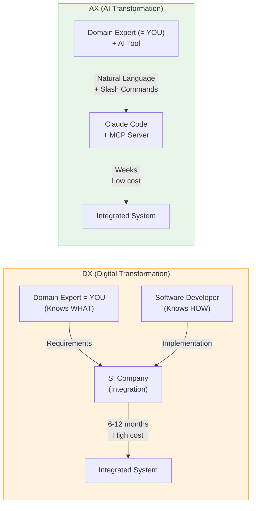
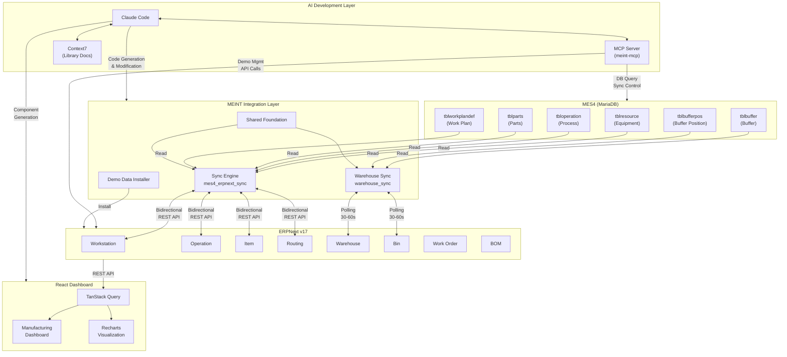
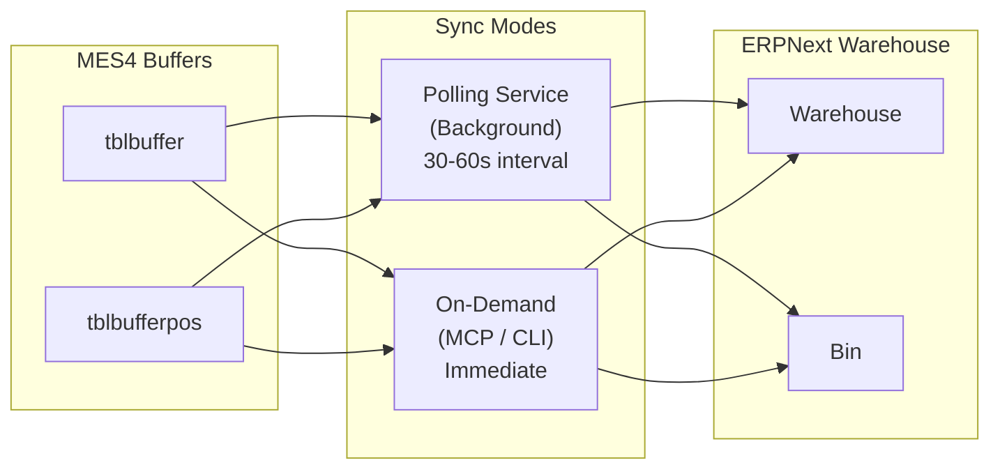
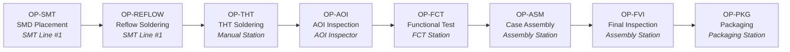
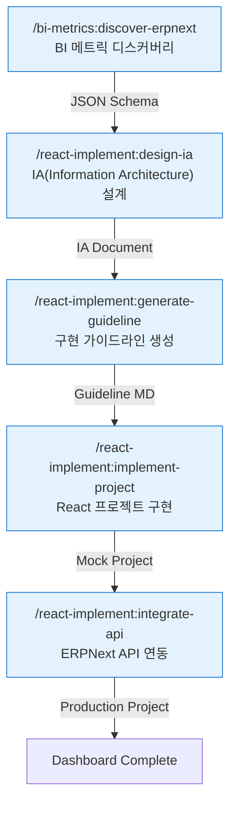
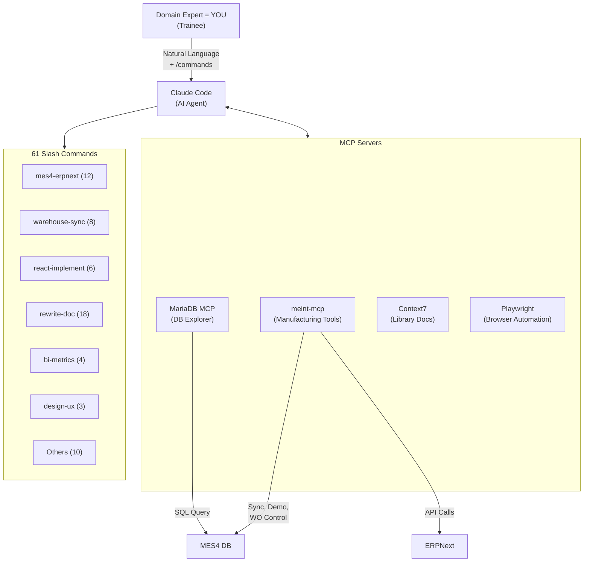
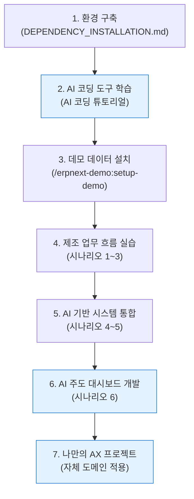
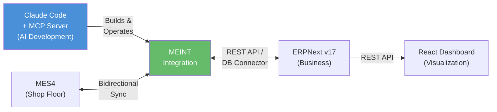

# MEINT PROJECT 강의 노트

## 생성형 AI 도구를 이용한 제조 AX 프로젝트

> **학습 목표:** 이 문서를 통해 MEINT 프로젝트의 전체 구조와 핵심 구성 요소를 이해하고, 생성형 AI 도구가 제조 시스템 통합을 어떻게 가속하는지 파악한다. AI 기반 개발 방법론(Claude Code + MCP)이 전통적 개발 방식과 어떻게 다른지 설명할 수 있게 되는 것을 목표로 한다.

### Executive Summary

MEINT(MES-ERP Integration)는 Festo MES4(공장 현장)와 ERPNext v17(경영 관리) 사이의 **데이터 단절을 해소하는 제조 AX 프로젝트**이다. 프로젝트의 모든 산출물 — 동기화 엔진, 대시보드, 데모 데이터, 문서 — 이 **생성형 AI(Claude Code + MCP 서버)를 핵심 개발 방법론**으로 활용하여 만들어졌다.

**시스템 구조:** 6계층 아키텍처(MES → Foundation → Integration → ERP → Presentation → AI Development)로 구성되며, 최상위 AI 개발 계층이 나머지 모든 계층을 생성하고 운영한다.

**4대 핵심 구성 요소:**

- **마스터 데이터 동기화** — 7개 엔티티 매퍼로 MES4-ERPNext 양방향 동기화. JSON ID 매핑, 스냅샷 삭제 감지, 타임스탬프 기반 충돌 해결
- **재고 동기화** — 폴링(30~60초) + 온디맨드 하이브리드 아키텍처. 잠금 관리자로 동시 실행 방지, 3단계 Parts-Item 매핑
- **제조 데모 데이터** — IoT 센서 모듈 제조 시나리오(16 품목, 4 BOM, 8 공정, 6 작업장). 구매→입고→생산→출하 전체 업무 흐름 학습용
- **React 대시보드** — Work Order, Job Card, BOM, KPI를 통합 시각화. 슬래시 명령 파이프라인(메트릭 탐색 → IA 설계 → 가이드라인 → 구현 → API 연동)으로 AI 주도 개발

**AX 인프라:** Claude Code + MCP 서버(meint-mcp) + 61개 슬래시 명령(9개 카테고리)으로 워크플로우가 표준화되어 있어, 도메인 전문가가 AI와 협업하여 전문 개발팀 없이도 시스템 통합을 직접 수행할 수 있다.

---

## 목차

- [Executive Summary](#executive-summary)
- [1. MEINT란 무엇인가](#1-meint란-무엇인가)
- [2. 제조 AX의 배경: DX에서 AX로](#2-제조-ax의-배경-dx에서-ax로)
- [3. 시스템 아키텍처](#3-시스템-아키텍처)
- [4. 핵심 구성 요소 상세](#4-핵심-구성-요소-상세)
  - [4.1 MES4-ERPNext 마스터 데이터 동기화](#41-mes4-erpnext-마스터-데이터-동기화)
  - [4.2 Warehouse/재고 동기화](#42-warehouse재고-동기화)
  - [4.3 제조 데모 데이터](#43-제조-데모-데이터)
  - [4.4 React 제조 대시보드](#44-react-제조-대시보드)
- [5. 기술 스택 총정리](#5-기술-스택-총정리)
- [6. 프로젝트 디렉토리 구조](#6-프로젝트-디렉토리-구조)
- [7. 학습 시나리오](#7-학습-시나리오)
- [8. AI 기반 개발 환경 (AX 인프라)](#8-ai-기반-개발-환경-ax-인프라)
- [9. 관련 문서 및 학습 경로](#9-관련-문서-및-학습-경로)
- [10. 요약](#10-요약)

---

## 1. MEINT란 무엇인가

### 개요

MEINT는 **MES-ERP Integration**의 약칭이다. 이름 그대로, 두 개의 산업용 소프트웨어 시스템을 연결하는 프로젝트이다.

- **MES(Manufacturing Execution System, 제조 실행 시스템)**: 공장 현장에서 장비를 직접 제어하고, 생산 공정 데이터를 수집하는 시스템이다. 설비·센서에서 자동 수집된 데이터(Machine-driven)를 기반으로 초/분 단위의 실시간 현장 제어를 수행한다. MEINT에서는 Festo社의 **MES4**를 사용한다.
- **ERP(Enterprise Resource Planning, 전사적 자원 관리)**: 구매, 판매, 재고, 제조, 회계 등 기업 전반의 업무를 통합 관리하는 시스템이다. 작업자가 시스템에 입력한 데이터(Human-driven)를 기반으로 일/주 단위의 계획·실적 집계를 수행한다. MEINT에서는 오픈소스 ERP인 **ERPNext**를 사용한다.

이 두 시스템은 각각 다른 계층에서 동작한다. MES는 **공장 현장(Shop Floor)** 에 가깝고, ERP는 **경영 관리(Business Management)** 에 가깝다. 실무적으로는 **데이터 소스**로 구분할 수 있다 — 설비가 보내는 신호를 다루면 MES, 사람이 입력한 데이터를 다루면 ERP이다. MEINT는 이 두 계층 사이의 **데이터 단절(Data Silo)** 을 해소하여, 현장 데이터가 경영 의사결정에 실시간으로 반영되는 환경을 구축한다.

그런데 MEINT의 진짜 특이점은 **어떻게 구축했는가**에 있다. 이 프로젝트의 동기화 엔진, 데모 데이터, 대시보드, 심지어 문서까지 — 모두 **생성형 AI 도구(Claude Code)** 를 핵심 개발 도구로 활용하여 만들어졌다. MEINT는 단순한 MES-ERP 통합 프로젝트가 아니라, **생성형 AI가 제조 시스템 통합을 어떻게 가속할 수 있는지 보여주는 AX(AI Transformation) 사례**이다.

### 왜 AI 기반 제조 시스템 통합인가

제조 현장에서 흔히 발생하는 문제와, MEINT가 **AI 도구를 활용하여** 이를 해결하는 방식을 살펴보자.

| 문제 상황 | 전통적 접근 | MEINT의 AX 접근 |
|-----------|------------|-----------------|
| ERP의 재고 수량과 실제 창고 수량이 다르다 | SI 업체에 동기화 모듈 외주 개발 | Claude Code로 Warehouse Sync 직접 구축 (슬래시 명령 기반) |
| 새로운 부품을 MES에 등록했는데 ERP에는 없다 | 수동 이중 입력 또는 ETL 파이프라인 구축 | AI가 DB 스키마를 분석하여 매퍼(Mapper) 자동 생성 |
| 생산 현황을 파악하려면 여러 시스템을 각각 확인해야 한다 | 프론트엔드 개발자 채용 → 대시보드 수개월 개발 | Claude Code로 React 대시보드 설계부터 구현까지 AI 주도 |
| 시스템 통합에 전문 인력과 긴 개발 기간이 필요하다 | 6~12개월 프로젝트, 전문 개발팀 필요 | AI 도구 + 도메인 전문가(= 여러분) 조합으로 개발 기간 대폭 단축 |

#### 문제별 상세 비교 다이어그램

**문제 1: ERP 재고와 실제 창고 수량 불일치(Inventory Mismatch)**

```
┌─────────────────────────────────────────────────────────────────────┐
│ Problem: Inventory Mismatch                                         │
│                                                                     │
│   MES4 Buffer        ERPNext Warehouse                              │
│   ┌──────────┐       ┌──────────┐                                   │
│   │ Qty: 150 │       │ Qty: 120 │  ◄── Data out of sync!            │
│   └──────────┘       └──────────┘                                   │
├──────────────────────────┬──────────────────────────────────────────┤
│   Traditional Approach   │   AX Approach                            │
│                          │                                          │
│   Company ──► SI Vendor  │   Domain Expert (= YOU)                  │
│      │          │        │      │                                   │
│      │  RFP     │ Dev    │      │ /warehouse-sync:sync-now          │
│      ▼          ▼        │      ▼                                   │
│   Contract   Custom      │   Claude Code                            │
│   6 months   Module      │      │                                   │
│      │          │        │      │ Auto-generate                     │
│      ▼          ▼        │      ▼                                   │
│   $$$ High   Sync OK    │   Warehouse Sync                          │
│     Cost                 │   (Polling 30-60s)                       │
│                          │      │                                   │
│                          │      ▼                                   │
│                          │   Real-time Sync OK                      │
└──────────────────────────┴──────────────────────────────────────────┘
```

- 문제 상황(Problem): MES4 버퍼(Buffer)의 실제 수량과 ERPNext 창고(Warehouse)의 장부 수량이 불일치
- 전통적 접근(Traditional): SI 업체에 외주 발주 → 계약 → 커스텀 모듈 개발 (6개월, 고비용)
- AX 접근: 도메인 전문가(= 훈련생 여러분)가 슬래시 명령(/warehouse-sync)으로 Claude Code에 지시 → 30~60초 주기 폴링 동기화 자동 구축

**문제 2: MES 신규 부품이 ERP에 미등록(Master Data Silo)**

```
┌─────────────────────────────────────────────────────────────────────┐
│ Problem: Master Data Silo                                           │
│                                                                     │
│   MES4 Parts             ERPNext Items                              │
│   ┌──────────┐           ┌──────────┐                               │
│   │ Part-201 │           │   ???    │  ◄── Not registered!          │
│   │ (New!)   │           │          │                               │
│   └──────────┘           └──────────┘                               │
├──────────────────────────┬──────────────────────────────────────────┤
│   Traditional Approach   │   AX Approach                            │
│                          │                                          │
│   Option A: Manual       │   Claude Code                            │
│   ┌───────┐  ┌───────┐  │      │                                    │
│   │ MES4  │  │ERPNext│  │      │ Analyze DB Schema                  │
│   │ Input │  │ Input │  │      ▼                                    │
│   └───┬───┘  └───┬───┘  │   tblparts ──mapping──► Item              │
│       │          │       │      │                                   │
│   Dual entry = Errors   │      │ Auto-generate Mapper               │
│                          │      ▼                                   │
│   Option B: ETL          │   parts_mapper.py                        │
│   Dev Team builds        │      │                                   │
│   ETL Pipeline           │      │ /mes4-erpnext:sync                │
│   (weeks ~ months)       │      ▼                                   │
│                          │   Bidirectional Sync OK                  │
└──────────────────────────┴──────────────────────────────────────────┘
```

- 문제 상황(Problem): MES4에 새 부품(Part)을 등록했지만 ERPNext에는 대응하는 품목(Item)이 없음
- 전통적 접근(Traditional): (A) 수동 이중 입력 → 오류 발생 위험, (B) ETL 파이프라인 구축 → 수주~수개월 소요
- AX 접근: Claude Code가 MES4 DB 스키마(tblparts)를 분석하여 매퍼(parts_mapper.py) 자동 생성 → 양방향 동기화

**문제 3: 생산 현황 파악을 위한 다중 시스템 접근(Fragmented Visibility)**

```
┌─────────────────────────────────────────────────────────────────────┐
│ Problem: Fragmented Visibility                                      │
│                                                                     │
│   ┌──────┐  ┌──────┐  ┌──────┐                                      │
│   │ MES4 │  │ERPNext│  │Excel │  ◄── Check each one separately!     │
│   │Screen│  │ Web  │  │Report│                                      │
│   └──┬───┘  └──┬───┘  └──┬───┘                                      │
│      └─────────┴─────────┘                                          │
│         No unified view                                             │
├──────────────────────────┬──────────────────────────────────────────┤
│   Traditional Approach   │   AX Approach                            │
│                          │                                          │
│   Hire FE Developer      │   /bi-metrics:discover-erpnext           │
│      │                   │      │                                   │
│      ▼                   │      ▼                                   │
│   UX Designer            │   /react-implement:design-ia             │
│      │                   │      │                                   │
│      ▼                   │      ▼                                   │
│   Months of Dev          │   /react-implement:generate-guideline    │
│      │                   │      │                                   │
│      ▼                   │      ▼                                   │
│   Dashboard v1.0         │   /react-implement:implement-project     │
│   (3-6 months later)     │      │                                   │
│                          │      ▼                                   │
│                          │   React Dashboard                        │
│                          │   (AI Pipeline = Days)                   │
└──────────────────────────┴──────────────────────────────────────────┘
```

- 문제 상황(Problem): 생산 현황을 파악하려면 MES4, ERPNext, 엑셀(Excel) 등 여러 시스템을 개별 확인
- 전통적 접근(Traditional): 프론트엔드 개발자 채용 → UX 설계 → 수개월 개발 → 대시보드 v1.0 완성 (3~6개월)
- AX 접근: 슬래시 명령 파이프라인으로 메트릭 탐색 → IA 설계 → 가이드라인 → 구현까지 AI 주도 (수일 내)

**문제 4: 시스템 통합의 높은 진입 장벽(Integration Barrier)**

```
┌─────────────────────────────────────────────────────────────────────┐
│ Problem: Integration Barrier                                        │
│                                                                     │
│   ┌──────────┐         ┌──────────┐                                 │
│   │   MES4   │ ????? ──►│ ERPNext  │                                │
│   │ (Shop    │         │(Business │                                 │
│   │  Floor)  │         │  Mgmt)   │                                 │
│   └──────────┘         └──────────┘                                 │
│        Gap: Different DB, API, Schema, Logic                        │
├──────────────────────────┬──────────────────────────────────────────┤
│   Traditional Approach   │   AX Approach                            │
│                          │                                          │
│   ┌─────────────────┐   │   ┌─────────────────┐                     │
│   │ Project Team    │   │   │ Domain Expert   │                     │
│   │ - PM            │   │   │ (= YOU)         │                     │
│   │ - Backend Dev   │   │   │ + Claude Code   │                     │
│   │ - Frontend Dev  │   │   │ + MCP Server    │                     │
│   │ - DBA           │   │   └────────┬────────┘                     │
│   │ - Domain Expert │   │   Analyze ──► Code ──► Test               │
│   └────────┬────────┘   │            │                              │
│            │             │   Slash Commands                         │
│   6-12 months            │   standardize workflow                   │
│   High cost              │            │                             │
│            │             │      Weeks, Low cost                     │
│            ▼             │            ▼                             │
│   Integrated System      │   Integrated System                      │
└──────────────────────────┴──────────────────────────────────────────┘
```

- 문제 상황(Problem): MES4(현장 계층)와 ERPNext(경영 계층)는 DB, API, 스키마, 비즈니스 로직이 모두 다름
- 전통적 접근(Traditional): PM, 백엔드 개발자, 프론트엔드 개발자, DBA, 도메인 전문가 등 전문 팀 구성 → 6~12개월, 고비용
- AX 접근: 도메인 전문가(= 여러분) 1인 + Claude Code + MCP 서버 조합 → 슬래시 명령으로 워크플로우 표준화 → 수주 내 완료, 저비용

### 핵심 가치 4가지

1. **AI 주도 개발** — 생성형 AI(Claude Code)가 설계, 코딩, 테스트, 문서화 전 과정을 가속
2. **도메인 전문성 증폭** — 제조 도메인 지식을 가진 사람(= 여러분 같은 훈련생)이 AI 도구로 직접 시스템을 구축
3. **양방향 동기화** — MES4 → ERPNext, ERPNext → MES4 양방향 마스터 데이터 동기화
4. **재현 가능한 방법론** — MCP 서버 + 슬래시 명령 체계로 AI 개발 워크플로우를 표준화

---

## 2. 제조 AX의 배경: DX에서 AX로

### 개요

MEINT 프로젝트를 이해하기 위한 거시적 맥락을 살펴본다. 제조업의 디지털 전환(DX)이 왜 AI 전환(AX)으로 진화하고 있는지, 그리고 생성형 AI 도구가 이 전환에서 어떤 역할을 하는지 파악한다.

### DX(Digital Transformation)의 한계

지난 10여 년간 제조업의 화두는 **디지털 전환(DX, Digital Transformation)** 이었다. MES, ERP, IoT, 클라우드 등의 시스템을 도입하여 공장을 디지털화하는 것이 목표였다. 그러나 많은 기업이 DX에서 실질적 성과를 거두지 못한 이유가 있다.

| DX의 과제 | 현실적 장벽 |
|-----------|------------|
| MES-ERP 통합 | SI 업체 의존, 높은 비용, 긴 개발 기간 |
| 데이터 시각화 대시보드 | 프론트엔드 전문 인력 부족 |
| 시스템 간 데이터 동기화 | 이기종 DB 스키마 이해 + 매핑 로직 작성에 전문성 필요 |
| 문서화 및 지식 전이 | 개발 후 문서화 누락, 담당자 퇴사 시 지식 유실 |

결국 DX의 가장 큰 병목은 **"기술 구현 역량"** 이었다. 제조 도메인 전문가 — 즉, 제조 현장을 이해하는 **여러분 같은 훈련생** — 는 무엇이 필요한지 알지만 직접 구현할 수 없고, 소프트웨어 개발자는 구현할 수 있지만 제조 도메인을 모른다.

### AX(AI Transformation): 생성형 AI가 바꾸는 게임의 규칙

**AX(AI Transformation)** 는 DX의 다음 단계로, **AI가 전환의 핵심 동력**이 되는 패러다임이다. 특히 생성형 AI 코딩 도구의 등장은 위의 장벽을 근본적으로 허물고 있다.



| 관점 | DX 패러다임 | AX 패러다임 |
|------|------------|------------|
| **구현 주체** | 전문 개발팀 / SI 업체 | 도메인 전문가(= 여러분) + AI 도구 |
| **개발 방식** | 요구사항 → 설계 → 코딩 → 테스트 (폭포수/애자일) | 자연어 지시 → AI 코드 생성 → 검증 → 반복 |
| **소통 비용** | 도메인 전문가 ↔ 개발자 간 번역 필요 | 도메인 전문가(= 여러분)가 AI에게 직접 지시 |
| **문서화** | 개발 후 별도 작성 (종종 누락) | AI가 코드와 문서를 동시 생성 |
| **유지보수** | 원 개발자/업체 의존 | AI 도구로 누구나 코드 이해 및 수정 가능 |

### MEINT: 제조 AX의 실증 사례

MEINT 프로젝트는 이 AX 패러다임을 **실제로 적용한 사례**이다.

- **동기화 엔진**: MES4의 DB 스키마를 Claude Code가 분석하고, ERPNext DocType과의 매핑 로직을 생성
- **React 대시보드**: BI 메트릭 디스커버리 → IA 설계 → 가이드라인 생성 → 프로젝트 구현까지 슬래시 명령 파이프라인으로 진행
- **데모 데이터**: IoT 센서 모듈 제조 시나리오를 AI와 협업하여 설계하고 JSON 데이터 자동 생성
- **문서**: 강의 노트, 슬라이드, 튜토리얼 모두 AI 문서 변환 명령(`/rewrite-doc:*`)으로 생성

> **핵심 통찰:** MEINT에서 생성형 AI는 "보조 도구"가 아니라 **"핵심 개발 방법론"** 이다. 프로젝트의 거의 모든 산출물이 AI와의 협업으로 만들어졌고, 이 워크플로우 자체가 MCP 서버와 슬래시 명령으로 체계화되어 재현 가능하다.

---

## 3. 시스템 아키텍처

### 개요

MEINT의 아키텍처를 이해하기 위해, 6개 계층 구조를 파악하고, 각 계층 간 데이터가 어떻게 흐르는지 살펴본다. 기존 5계층에 **AI 개발 계층**이 추가된 것이 AX 관점의 핵심이다.

### 6계층 스택 구조

```
┌─────────────────────────────────────────────────┐
│           AI Development Layer                   │
│   Claude Code + MCP Server                       │
│   (61 Slash Commands / Context7 / MCP Tools)     │
├─────────────────────────────────────────────────┤
│           Presentation Layer                     │
│   React Dashboard                                │
│   (Work Orders / Job Cards / BOM / KPI Metrics)  │
├─────────────────────────────────────────────────┤
│           ERP Layer                              │
│   Frappe/ERPNext v17                             │
│   (Item / BOM / Routing / Work Order / Warehouse)│
├─────────────────────────────────────────────────┤
│           Integration Layer                      │
│   MEINT Sync Tools (Python)                      │
│   (Sync Engine / Warehouse Sync / Demo Installer)│
├─────────────────────────────────────────────────┤
│           Foundation Layer                        │
│   Shared Modules                                 │
│   (DB Connector / REST Client / Logger / Config) │
├─────────────────────────────────────────────────┤
│           MES Layer                              │
│   MES4 MariaDB                                   │
│   (Resources / Operations / Parts / Buffers)     │
└─────────────────────────────────────────────────┘
```

각 계층의 역할을 아래에서 위로 설명한다.

**1) MES 계층(MES Layer)**
- MES4의 MariaDB 데이터베이스가 위치하는 최하위 계층
- 장비(Resource), 공정(Operation), 부품(Parts), 버퍼(Buffer) 등 현장 데이터를 저장
- MEINT에서는 **읽기 전용(Read-Only)** 으로 접근하는 것이 기본 원칙

**2) 기반 계층(Foundation Layer)**
- 모든 동기화 도구가 공유하는 공통 모듈
- `db_connector.py` — MES4 MariaDB 읽기 전용 커넥터 (Python Context Manager 패턴)
- `erpnext_client.py` — ERPNext REST API 클라이언트 래퍼
- `config_base.py` — 환경 변수(`.env`) 기반 설정 관리
- `logger.py` — 동기화 통계 추적 기능이 포함된 로거

**3) 통합 계층(Integration Layer)**
- MEINT의 핵심 비즈니스 로직이 위치하는 계층
- 마스터 데이터 동기화 엔진 (`mes4_erpnext_sync`)
- 재고 동기화 폴링 서비스 (`warehouse_sync`)
- 데모 데이터 통합 설치기 (`install_all_demo`)

**4) ERP 계층(ERP Layer)**
- Frappe/ERPNext v17이 동작하는 계층
- ERPNext의 제조 모듈(Manufacturing Module)은 Item, BOM, Routing, Work Order, Warehouse 등의 DocType을 제공한다 [공식 문서 참조]
- Frappe Framework는 DocType 기반의 자동 REST API 생성을 지원하므로, 별도 API 개발 없이 `/api/resource/:doctype` 엔드포인트로 데이터에 접근할 수 있다

**5) 프레젠테이션 계층(Presentation Layer)**
- React 기반 제조 대시보드
- ERPNext REST API에서 데이터를 가져와 시각화
- TanStack Query(React Query)로 서버 상태를 관리하고, Recharts로 차트를 렌더링

**6) AI 개발 계층(AI Development Layer)**
- MEINT의 AX 관점에서 가장 중요한 계층
- **Claude Code**: 생성형 AI 코딩 도구. 자연어 지시로 코드 생성, 분석, 수정
- **MCP 서버(meint-mcp)**: Claude Code에 제조 도메인 전용 도구를 제공하는 서버. MES4 DB 직접 조회, ERPNext 데모 관리, 동기화 제어 등 61개 슬래시 명령을 포함
- **Context7**: 외부 라이브러리 공식 문서를 실시간으로 참조하여 최신 API 정보 기반 코드 생성

> **AX 관점의 핵심:** 이 계층은 다른 모든 계층을 **"만드는"** 계층이다. 통합 계층의 Python 코드, 프레젠테이션 계층의 React 컴포넌트, 심지어 이 문서까지 — 모두 AI 개발 계층에서 생성되었다.

### 데이터 흐름 다이어그램



> **핵심 포인트:** 데이터는 MES4에서 시작하여 통합 계층을 거쳐 ERPNext로 흐르고, 최종적으로 React 대시보드에서 시각화된다. 그리고 이 전체 파이프라인을 **AI 개발 계층이 설계하고 구축했다**. 마스터 데이터는 양방향 동기화가 가능하지만, 재고 데이터는 MES4 → ERPNext 방향이 주된 흐름이다.

---

## 4. 핵심 구성 요소 상세

### 개요

MEINT는 4개의 핵심 구성 요소로 이루어져 있다. 각 구성 요소의 동작 원리, 데이터 모델, 그리고 실제 사용법을 상세히 살펴본다. 각 구성 요소가 AI 도구와 어떻게 연계되는지도 함께 설명한다.

### 4.1 MES4-ERPNext 마스터 데이터 동기화

#### 무엇을 동기화하는가

마스터 데이터(Master Data)란 업무 처리의 기준이 되는 **기본 정보**를 말한다. 제조업에서는 어떤 장비가 있는지(Workstation), 어떤 공정을 수행하는지(Operation), 어떤 부품을 사용하는지(Item), 어떤 순서로 작업하는지(Routing) 등이 마스터 데이터에 해당한다.

MES4와 ERPNext는 동일한 제조 마스터 데이터를 **서로 다른 테이블 구조**로 저장한다. 동기화 엔진은 이 차이를 매퍼(Mapper)로 해결한다.

#### 엔티티 매핑 테이블

동기화는 **의존성 순서**에 따라 실행된다. 예를 들어, Routing(작업 계획)은 Operation(공정)과 Item(품목)에 의존하므로, Operation과 Item이 먼저 동기화되어야 한다.

| 순서 | MES4 테이블 | ERPNext DocType | 역할 | 의존 대상 |
|------|------------|-----------------|------|-----------|
| 1 | tblparametertypes 외 | MES Parameter Type 외 | 룩업 데이터(Lookup) | 없음 |
| 2 | tblresource | Workstation | 장비/작업장 | 없음 |
| 3 | tbloperation | Operation | 제조 공정 | 없음 |
| 4 | tbloperationparameter | MES Operation Parameter | 공정 파라미터 | Operation |
| 5 | tblparts | Item | 품목/부품 | 없음 |
| 6 | tblworkplandef + tblstepdef | Routing | 작업 계획 | Operation, Item |
| 7 | tblstepparameterdef | MES Step Parameter Def | 공정 단계 파라미터 | Routing |

#### 동기화 메커니즘

동기화 엔진은 3가지 핵심 메커니즘을 사용한다.

**1) JSON 파일 기반 ID 매핑**

MES4와 ERPNext는 서로 다른 ID 체계를 사용한다. MES4는 정수형 ID(예: `ResourceId = 42`), ERPNext는 문자열 이름(예: `name = "SMT 라인 #1"`)을 사용한다. 동기화 엔진은 이 대응 관계를 `sync_mapping.json` 파일에 영구 저장한다.

```json
{
  "resources": {
    "42": "SMT 라인 #1",
    "43": "수동 납땜 스테이션"
  },
  "parts": {
    "101": "RM-PCB-001",
    "102": "RM-MCU-001"
  }
}
```

**2) 스냅샷 기반 삭제 감지(Snapshot-based Delete Detection)**

한쪽 시스템에서 레코드가 삭제되었을 때 이를 감지하는 메커니즘이다. 동기화 실행 시마다 전체 레코드 목록의 스냅샷을 저장하고, 다음 실행 시 이전 스냅샷과 비교하여 사라진 레코드를 찾아낸다.

**3) 충돌 감지 및 해결**

양방향 동기화 시 동일 레코드가 양쪽에서 동시에 수정되면 충돌이 발생한다. 엔진은 수정 시각(timestamp)을 비교하여 최신 변경을 우선 적용하는 전략을 사용한다.

#### AI 도구 연계: 슬래시 명령으로 동기화 운영

동기화 작업은 Claude Code의 슬래시 명령으로 직접 제어할 수 있다. MCP 서버가 MES4 DB와 ERPNext API 양쪽에 접근 권한을 가지고 있기 때문이다.

```bash
/mes4-erpnext:status          # 동기화 상태 확인
/mes4-erpnext:sync            # 전체 동기화 실행
/mes4-erpnext:compare         # MES4 vs ERPNext 데이터 비교
/mes4-erpnext:find-unsynced   # 미동기화 레코드 탐색
```

### 4.2 Warehouse/재고 동기화

#### 개념: 버퍼(Buffer)와 창고(Warehouse)

MES4에서 **버퍼(Buffer)** 는 장비 내부 또는 장비 사이에 위치한 임시 저장 공간이다. 컨베이어의 특정 위치나 자동 창고(ASRS)의 셀이 각각 하나의 버퍼가 된다. ERPNext에서 이에 대응하는 개념이 **창고(Warehouse)** 이다.

| MES4 | ERPNext | 설명 |
|------|---------|------|
| tblbuffer | Warehouse | 저장 공간 자체. ResourceId + BufNo 조합으로 명명 |
| tblbufferpos | Bin | 저장 공간 내 개별 위치. 위치 단위 데이터를 품목-창고 단위로 집계 |

#### 동작 방식: 하이브리드 아키텍처

재고 동기화는 두 가지 모드를 지원한다.



- **폴링 서비스(Polling Service)**: 백그라운드에서 30~60초 주기로 자동 실행. MES4 버퍼 데이터 변경을 감지하여 ERPNext에 반영
- **온디맨드(On-Demand)**: MCP 서버 또는 CLI 명령으로 즉시 동기화 실행. 긴급한 재고 확인이나 디버깅 시 사용
- **잠금 관리자(Lock Manager)**: 폴링과 온디맨드가 동시에 실행되는 것을 방지. 파일 기반 잠금으로 데이터 정합성 보장

#### Parts-Item 매핑 우선순위

재고 동기화에서 MES4의 Part를 ERPNext의 Item에 대응시킬 때, 3단계 우선순위를 적용한다.

1. **수동 오버라이드 매핑** — `warehouse_sync/mapping_data/parts_item_mapping.json`
2. **마스터 동기화 매핑 공유** — `mes4_erpnext_sync/mapping_data/sync_mapping.json`
3. **DB 자동 매칭** — MES4 Part의 `Short` 필드와 ERPNext Item의 `item_code`가 일치하는 경우

> **왜 3단계인가?** 모든 Part가 마스터 동기화를 통해 ERPNext에 등록되는 것은 아니다. 수동으로 매핑해야 하는 특수한 경우도 있고, 이미 ERPNext에 존재하는 Item과 자동 매칭이 가능한 경우도 있다. 이 3단계 구조로 유연한 매핑을 보장한다.

#### AI 도구 연계: 실시간 모니터링과 디버깅

```bash
/warehouse-sync:status        # 동기화 상태 확인
/warehouse-sync:sync-now      # 즉시 동기화 실행
/warehouse-sync:compare       # MES4 vs ERPNext 재고 비교
/warehouse-sync:find-mismatch # 불일치 항목 탐색
```

### 4.3 제조 데모 데이터

#### 시나리오: IoT 센서 모듈 제조

MEINT의 데모 데이터는 **IoT 센서 모듈**을 제조하는 시나리오를 기반으로 한다. PCB 기판 위에 마이크로컨트롤러와 센서를 실장하고, 케이스에 조립한 뒤 포장하는 전체 공정을 포함한다.

#### 제품 구조 (BOM 트리)

```
FG-IOT-001 (IoT Sensor Module Standard)
├── SA-PCBA-001 (PCB Assembly)       ... Sub Assembly
│   ├── RM-PCB-001: PCB Board
│   ├── RM-MCU-001: Microcontroller
│   ├── RM-SEN-001: Temp/Humidity Sensor
│   ├── RM-RES-001: Resistor Set
│   ├── RM-CAP-001: Capacitor Set
│   ├── RM-CON-001: Connector Set
│   ├── RM-LED-001: LED Indicator
│   └── RM-ANT-001: Antenna Module
├── RM-CSE-001: Plastic Case
├── RM-SCR-001: M2 Screw Set
├── RM-LBL-001: Label Sticker
└── RM-PKG-001: Packaging Box
```

- **원자재(Raw Material, RM-)**: 12개 — PCB, MCU, 센서, 저항, 커패시터, 커넥터, LED, 안테나, 케이스, 나사, 라벨, 포장 박스
- **반제품(Sub Assembly, SA-)**: 2개 — PCB 조립체(표준형, 확장형)
- **완제품(Finished Goods, FG-)**: 2개 — IoT 센서 모듈(표준형, 확장형)

#### 제조 공정 흐름

8단계 공정을 6개 작업장에서 수행한다.



| 작업장 | 시간당 비용 | 수행 공정 |
|--------|-----------|-----------|
| SMT 라인 #1 | 50,000원 | SMD 부품 표면실장, 리플로우 솔더링 |
| 수동 납땜 스테이션 | 20,000원 | 스루홀 부품 수동 납땜 |
| AOI 검사기 | 30,000원 | 자동광학검사 |
| FCT 테스트 스테이션 | 25,000원 | 기능검사 |
| 조립 스테이션 | 15,000원 | 케이스 조립, 최종검사 |
| 포장 스테이션 | 10,000원 | 제품 포장 및 라벨링 |

#### 포함된 거래 데이터

데모 데이터에는 마스터 데이터뿐 아니라 실제 업무 흐름을 학습할 수 있는 거래 데이터도 포함된다.

- **구매주문(Purchase Order)**: 12건 — 원자재 발주
- **판매주문(Sales Order)**: 5건 — 완제품 수주
- **기초재고(Stock Entry)**: 12건 — 원자재 입고
- **고객(Customer)**: 5개사 / **공급업체(Supplier)**: 5개사

#### 설치 및 삭제

```bash
# 데모 데이터 설치 (기본 회사에)
python tools/install_all_demo/setup_all_demo.py --site meint.local

# 데모 데이터 삭제
python tools/install_all_demo/clear_all_demo.py --site meint.local

# 설치 상태 확인
python tools/install_all_demo/check_demo_status.py --site meint.local

# 슬래시 명령으로도 가능
/erpnext-demo:setup-demo      # 설치
/erpnext-demo:clear-demo      # 삭제
/erpnext-demo:demo-status     # 상태 확인
```

> **주의사항:**
> - 설치 전 대상 회사(Company)가 ERPNext에 존재해야 한다
> - Item Group(Raw Material, Sub Assemblies, Products)은 자동 생성된다
> - 중복 데이터는 자동으로 건너뛴다(Idempotent)
> - 날짜는 설치 시점 기준으로 자동 조정된다

### 4.4 React 제조 대시보드

#### 역할과 기능

ERPNext REST API에서 데이터를 조회하여 제조 현황을 실시간으로 시각화하는 웹 대시보드이다.

| 기능 | 설명 | 관련 DocType |
|------|------|-------------|
| Work Order 추적 | 생산 지시 현황 및 진행률 표시 | Work Order |
| Job Card 관리 | 작업 카드별 공정 상태 추적 | Job Card |
| BOM 시각화 | 다단계 BOM 구조를 트리 뷰로 표현 | BOM |
| Workstation 가동률 | 설비별 다운타임 모니터링 | Workstation |
| 품질 검사 | 검사 결과 추적 및 합격/불합격 통계 | Quality Inspection |
| KPI 메트릭 | OEE, 생산성, 납기 준수율 등 핵심 지표 | 복합 데이터 |

#### 기술 스택

| 라이브러리 | 역할 | 선택 이유 |
|-----------|------|-----------|
| React 18 | UI 프레임워크 | 컴포넌트 기반 개발, 풍부한 생태계 |
| TypeScript | 타입 안정성 | 런타임 에러 사전 방지 |
| Vite | 번들러/개발 서버 | 빠른 HMR(Hot Module Replacement) |
| TanStack Query | 서버 상태 관리 | 캐싱, 자동 리페칭, 로딩/에러 상태 관리 |
| TanStack Table | 테이블 렌더링 | 정렬, 필터, 페이지네이션 내장 |
| Recharts | 차트 렌더링 | React 네이티브 차트 라이브러리 |
| Tailwind CSS + shadcn/ui | 스타일링 | 유틸리티 퍼스트 CSS + 접근성 컴포넌트 |

> **중요 설계 원칙:** 모든 데이터 페칭은 TanStack Query(`useQuery`)를 사용한다. `useState` + `useEffect` 조합으로 직접 API를 호출하지 않는다. TanStack Query가 캐싱, 자동 재요청, 로딩/에러 상태를 일관되게 관리하기 때문이다.

#### AI 주도 대시보드 개발 파이프라인

이 대시보드는 **슬래시 명령 파이프라인**을 통해 단계적으로 구축되었다. 이것이 MEINT의 AX 방법론이 가장 잘 드러나는 부분이다.



각 단계에서 AI가 수행하는 작업:

1. **메트릭 디스커버리** — ERPNext DB 스키마를 자동 분석하여 시각화 가능한 메트릭 목록 도출
2. **IA 설계** — 도출된 메트릭을 기반으로 대시보드의 정보 구조(페이지, 섹션, 위젯) 설계
3. **가이드라인 생성** — IA를 기존 React 프로젝트 구조에 맞는 구현 가이드라인으로 변환
4. **프로젝트 구현** — 가이드라인을 따라 컴포넌트, 훅, 타입 정의 등 실제 코드 생성
5. **API 연동** — Mock 데이터를 실제 ERPNext REST API 호출로 교체

> **AX의 의미:** 전통적으로 이 파이프라인의 각 단계는 서로 다른 전문가(데이터 분석가, UX 설계자, 프론트엔드 개발자)가 담당했다. MEINT에서는 도메인 전문가 — 바로 **여러분** — 한 명이 AI 도구와 협업하여 전체 파이프라인을 실행한다.

#### ERPNext REST API 연동 방식

Frappe Framework는 DocType을 정의하면 REST API가 자동 생성된다. 대시보드에서 ERPNext 데이터를 조회할 때는 다음 패턴을 사용한다. [공식 문서 참조]

```
GET /api/resource/:doctype
GET /api/resource/:doctype/:name
GET /api/resource/:doctype?filters=[["field","=","value"]]&fields=["field1","field2"]
```

예를 들어, 진행 중인 Work Order 목록을 가져오려면:

```
GET /api/resource/Work Order?filters=[["status","=","In Process"]]&fields=["name","production_item","qty","produced_qty"]
```

---

## 5. 기술 스택 총정리

### 개요

MEINT에서 사용하는 전체 기술 스택을 범주별로 정리한다. AX 관점에서 **AI 개발 도구가 최상위 범주**에 위치한다.

| 범주 | 기술 | 용도 |
|------|------|------|
| **AI 개발** | Claude Code (Opus 4.6) | 코드 생성, 분석, 리팩토링, 문서화 |
| **AI 인프라** | MCP 서버 (meint-mcp) | 제조 도메인 전용 도구 61개 제공 |
| **AI 참조** | Context7, MariaDB MCP | 라이브러리 문서 조회, DB 스키마 직접 탐색 |
| **ERP 플랫폼** | Frappe/ERPNext v17 | 제조, 구매, 판매, 재고, 회계 통합 관리 |
| **MES** | Festo MES4 (MariaDB) | 공장 현장 장비 제어 및 생산 공정 데이터 |
| **백엔드** | Python 3, Node.js | 동기화 엔진(Python), Frappe 서버(Node.js) |
| **데이터베이스** | MariaDB, Redis | 영구 저장(MariaDB), 캐시/큐(Redis) |
| **프론트엔드** | React 18 + TypeScript + Vite | 제조 모니터링 대시보드 |
| **UI 라이브러리** | Tailwind CSS, shadcn/ui, Recharts | 스타일링, UI 컴포넌트, 차트 |
| **데이터 페칭** | TanStack Query | 서버 상태 관리 및 캐싱 |
| **API** | ERPNext REST API, MariaDB Direct | ERP 데이터 접근, MES 데이터 직접 조회 |

### 서비스 포트 구성

MEINT의 각 서비스는 다음 포트에서 동작한다.

| 서비스 | 포트 | 프로토콜 |
|--------|------|----------|
| ERPNext Web | 8001 | HTTP |
| Redis Cache | 13001 | TCP |
| Redis Queue | 11001 | TCP |
| Socket.io | 9001 | WebSocket |

> **참고:** Frappe bench는 기본적으로 8000번 포트를 사용하지만, MEINT에서는 포트 충돌을 피하기 위해 `8001`로 설정되어 있다. Redis도 마찬가지로 기본 포트(6379, 11000, 13000)가 아닌 커스텀 포트를 사용한다.

---

## 6. 프로젝트 디렉토리 구조

### 개요

MEINT의 물리적 파일 구조를 이해하면 코드 탐색과 수정이 훨씬 수월해진다. 각 디렉토리의 역할을 파악해 두자.

### 전체 구조

```
meint/
├── .claude/                           # AI 개발 환경 설정
│   ├── commands/                      #   슬래시 명령 정의 (61개)
│   ├── guides/                        #   AI 코드 생성 가이드라인
│   └── config/                        #   언어, 포맷 설정
│
├── apps/                              # Frappe/ERPNext 앱 (Git 서브모듈)
│   ├── frappe/                        #   Frappe Framework 코어
│   └── erpnext/                       #   ERPNext 애플리케이션
│
├── sites/meint.local/                 # 사이트 설정 및 데이터
│   └── site_config.json               #   DB 접속 정보, 사이트 설정
│
├── tools/                             # MES4-ERPNext 통합 도구 (Python)
│   ├── shared/                        #   기반 계층
│   │   ├── config_base.py             #     환경 변수 설정 (.env)
│   │   ├── db_connector.py            #     MES4 MariaDB 커넥터
│   │   ├── erpnext_client.py          #     ERPNext REST API 클라이언트
│   │   └── logger.py                  #     동기화 통계 로거
│   │
│   ├── mes4_erpnext_sync/             #   마스터 데이터 동기화
│   │   ├── mappers/                   #     엔티티별 매퍼 (7종)
│   │   ├── sync/                      #     동기화 엔진, 스냅샷 관리
│   │   └── mapping_data/              #     ID 매핑 JSON 파일
│   │
│   ├── warehouse_sync/                #   재고 동기화
│   │   ├── polling/                   #     폴링 서비스, 잠금 관리자
│   │   └── mapping_data/              #     Parts-Item 오버라이드 매핑
│   │
│   ├── install_all_demo/              #   통합 데모 설치기
│   ├── manufacturing_demo_data/       #   IoT 센서 모듈 데모 데이터셋
│   │   └── data/                      #     JSON 데이터 파일 (10종)
│   └── sync_to_mcp.sh                #   MCP 서버 배포 스크립트
│
├── react-projects/                    # React 대시보드 프로젝트
│   └── erpnext-manufacturing-dashboard/
│       ├── src/                       #     소스 코드
│       └── package.json               #     의존성 정의
│
├── docs/                              # 프로젝트 문서
│   ├── meint-project/                 #   설정 가이드, 튜토리얼
│   │   ├── setup/                     #     의존성 설치, MariaDB, SSH 등
│   │   └── tutorials/                 #     대시보드 워크스루, AI 코딩
│
├── config/                            # Redis 설정 파일
└── CLAUDE.md                          # AI 개발 환경 프로젝트 지침
```

> **AX 관점:** `.claude/` 디렉토리와 `CLAUDE.md`가 AI 개발 계층의 물리적 실체이다. 슬래시 명령 정의(`.claude/commands/`)와 코드 생성 가이드라인(`.claude/guides/`)이 AI 도구의 동작을 규정한다.

### 모듈 간 의존성

```
shared/ ──┬── mes4_erpnext_sync/ ──(Parts-Item mapping)──► warehouse_sync/
           └── warehouse_sync/
install_all_demo/ ──► manufacturing_demo_data/

.claude/commands/ ──(Slash Commands)──► Claude Code ──(MCP)──► tools/
```

- `shared/`는 모든 동기화 도구의 기반이다
- `mes4_erpnext_sync`의 Parts-Item 매핑 결과를 `warehouse_sync`가 참조한다
- `install_all_demo`는 `manufacturing_demo_data`의 JSON 파일을 읽어 ERPNext에 설치한다
- `.claude/commands/`의 슬래시 명령이 Claude Code를 통해 `tools/`의 코드를 생성하고 운영한다

---

## 7. 학습 시나리오

### 개요

MEINT를 활용한 학습 시나리오를 6가지로 정리한다. 처음 3개는 제조 업무 흐름, 다음 2개는 시스템 통합, 마지막은 **AI 기반 개발 방법론** 실습이다.

### 시나리오 1: 구매 → 입고 사이클

**목표:** 원자재 발주부터 입고까지의 흐름을 이해한다.

```
1. Purchase Order 확인
   └─ 발주된 원자재 목록과 수량 파악
2. Purchase Receipt 생성
   └─ Purchase Order 기반으로 입고 전표 생성
3. 재고 입고 (Submit)
   └─ Submit 시 Warehouse의 Bin에 재고 수량 반영
4. Purchase Invoice 생성
   └─ 매입 세금계산서 발행
5. Payment Entry
   └─ 대금 결제 처리
```

### 시나리오 2: 판매주문 기반 제조 (Make to Order)

**목표:** 고객 주문 접수부터 제품 출하까지의 전체 흐름을 실습한다.

```
1. Sales Order 확인
   └─ 고객 주문 내역 파악 (FG-IOT-001 × 100EA)
2. Material Request 생성
   └─ 부족한 자재 파악 및 소요량 계산
3. 재고 확인
   └─ 원자재 재고 현황 점검
4. Work Order 생성
   └─ BOM 기반 생산 지시 생성
5. 생산 실행
   └─ Job Card 생성 → 각 공정 실행 → 완제품 입고
6. Delivery Note 생성
   └─ 출하 전표 발행
7. Sales Invoice → Payment Entry
   └─ 매출 세금계산서 발행 → 대금 수금
```

### 시나리오 3: 전체 MRP 사이클

**목표:** 자재 소요량 계획(MRP)의 자동화 흐름을 이해한다.

```
1. Sales Order 확인 (총 수요 분석)
2. Production Plan 생성
   └─ 복수 Sales Order를 하나의 생산 계획으로 통합
3. 자재 소요량 자동 계산
   └─ BOM 전개(Explosion) → 필요 원자재 수량 산출
4. 부족 원자재 → Purchase Order 자동 생성
5. Work Order 일괄 생성
   └─ 반제품(SA-) → 완제품(FG-) 순서로 생성
6. 생산 실행 → 납품
```

### 시나리오 4: MES4-ERPNext 통합 동기화

**목표:** 두 시스템 간 마스터 데이터 동기화의 동작 원리를 실습한다.

```
1. MES4 마스터 데이터 현황 확인
   └─ /mes4-erpnext:compare 로 양쪽 데이터 비교
2. 동기화 실행
   └─ /mes4-erpnext:sync 으로 전체 동기화
3. ERPNext에서 동기화 결과 확인
   └─ /mes4-erpnext:status 로 매핑 상태 확인
4. 미동기화 레코드 탐색
   └─ /mes4-erpnext:find-unsynced 로 누락된 항목 식별
5. 불일치 수정
   └─ /mes4-erpnext:fix-wo-mismatch 로 자동 수정
```

### 시나리오 5: 실시간 재고 모니터링

**목표:** MES4 버퍼 데이터가 ERPNext 창고에 실시간 반영되는 과정을 확인한다.

```
1. Warehouse 폴링 서비스 시작
   └─ /warehouse-sync:polling-control start
2. MES4 버퍼 데이터 변경
   └─ 장비 버퍼에 부품 투입/인출 시뮬레이션
3. ERPNext 자동 동기화 확인
   └─ /warehouse-sync:compare 로 실시간 확인
4. React 대시보드에서 모니터링
   └─ 재고 현황 시각화, 변동 추이 확인
```

### 시나리오 6: AI 기반 대시보드 개발 (AX 실습)

**목표:** 생성형 AI 도구로 새로운 대시보드를 설계부터 구현까지 진행하는 전체 워크플로우를 체험한다.

```
1. BI 메트릭 디스커버리
   └─ /bi-metrics:discover-erpnext 로 시각화 가능한 데이터 탐색
2. 대시보드 IA 설계
   └─ /react-implement:design-ia 로 정보 구조 설계
3. 구현 가이드라인 생성
   └─ /react-implement:generate-guideline 로 코드 생성 지침 작성
4. React 프로젝트 구현
   └─ /react-implement:implement-project 로 컴포넌트 자동 생성
5. API 연동
   └─ /react-implement:integrate-api 로 Mock → 실제 API 전환
6. 문서 자동 생성
   └─ /rewrite-doc:lecture 또는 /rewrite-doc:slides 로 튜토리얼 생성
```

> **AX 체험의 핵심:** 시나리오 6은 "프론트엔드 개발자가 되는 것"이 아니라, "도메인 전문가인 여러분이 AI 도구로 대시보드를 만드는 것"이다. 각 슬래시 명령이 하나의 전문가 역할을 대체한다.

---

## 8. AI 기반 개발 환경 (AX 인프라)

### 개요

MEINT의 AX 방법론을 가능하게 하는 인프라를 설명한다. Claude Code, MCP 서버, 슬래시 명령 체계가 어떻게 유기적으로 연결되는지 파악한다.

### Claude Code + MCP 서버 아키텍처



**핵심 구성 요소:**

- **Claude Code** — 사용자의 자연어 지시를 받아 코드를 생성하고, MCP 서버를 통해 외부 시스템과 상호작용하는 AI 에이전트
- **meint-mcp** — MEINT 전용 MCP 서버. MES4 DB 직접 조회, ERPNext 데모 관리, 동기화 제어, BI 메트릭 디스커버리 등 제조 도메인 전용 도구를 제공
- **MariaDB MCP** — MES4 데이터베이스의 스키마와 데이터를 직접 탐색할 수 있는 범용 DB 도구
- **Context7** — React, Frappe, ERPNext 등 외부 라이브러리의 최신 공식 문서를 실시간 참조

### 슬래시 명령 체계

61개의 슬래시 명령은 9개 카테고리로 조직되어 있다. 각 카테고리는 하나의 **업무 도메인**을 담당한다.

| 카테고리 | 명령 수 | 업무 도메인 | 예시 |
|----------|---------|------------|------|
| `mes4-erpnext` | 12 | 마스터 데이터 동기화 | `/mes4-erpnext:sync`, `/mes4-erpnext:status` |
| `warehouse-sync` | 8 | 창고/재고 동기화 | `/warehouse-sync:sync-now`, `/warehouse-sync:compare` |
| `erpnext-demo` | 5 | 데모 데이터 관리 | `/erpnext-demo:setup-demo`, `/erpnext-demo:clear-demo` |
| `react-implement` | 6 | 대시보드 구현 파이프라인 | `/react-implement:implement-project` |
| `bi-metrics` | 4 | BI 메트릭 디스커버리 | `/bi-metrics:discover-erpnext` |
| `design-ux` | 3 | UX/IA 설계 | `/design-ux:generate-ia` |
| `rewrite-doc` | 18 | 문서 변환/재작성 | `/rewrite-doc:lecture`, `/rewrite-doc:slides` |
| `query` | 2 | 복합 검색 | `/query:workspace` |
| `util` | 3 | 유틸리티 | `/util:update-project-index` |

> **슬래시 명령의 의미:** 각 명령은 단순한 CLI 래퍼가 아니다. 명령 정의 파일(`.claude/commands/`)에는 AI가 수행해야 할 **상세한 워크플로우 지침**이 포함되어 있다. 예를 들어, `/react-implement:implement-project`는 가이드라인 문서를 읽고, 프로젝트 구조를 분석하고, 컴포넌트를 생성하고, 테스트를 작성하는 전체 과정을 정의한다.

### 자주 사용하는 CLI 명령

```bash
# --- 데모 데이터 관리 ---
python tools/install_all_demo/setup_all_demo.py --site meint.local    # 설치
python tools/install_all_demo/clear_all_demo.py --site meint.local    # 삭제
python tools/install_all_demo/check_demo_status.py --site meint.local # 상태 확인

# --- Frappe/ERPNext ---
bench start                                    # 전체 서비스 시작
bench --site meint.local console               # Python 콘솔 (Frappe 컨텍스트)
bench --site meint.local migrate               # DB 마이그레이션
bench --site meint.local clear-cache           # Redis 캐시 초기화

# --- React 대시보드 ---
cd react-projects/erpnext-manufacturing-dashboard
npm run dev      # 개발 서버 (Vite HMR)
npm run build    # 프로덕션 빌드 (tsc + vite)

# --- MCP 서버 배포 ---
bash tools/sync_to_mcp.sh   # tools/ → ~/meint-mcp/src/meint_mcp/lib/ 배포
```

---

## 9. 관련 문서 및 학습 경로

### 문서 안내

| 문서 | 경로 | 설명 |
|------|------|------|
| 의존성 설치 가이드 | `docs/meint-project/setup/DEPENDENCY_INSTALLATION.md` | 시스템 요구사항 및 설치 절차 |
| AI 코딩 튜토리얼 | `docs/meint-project/tutorials/ai-coding/` | Claude Code를 활용한 개발 가이드 |
| 대시보드 튜토리얼 | `docs/meint-project/tutorials/meint-dashboard/` | 제조 대시보드 기능별 워크스루 |
| MES4 동기화 가이드 | `tools/mes4_erpnext_sync/README.md` | 마스터 데이터 동기화 상세 설명 |
| 재고 동기화 가이드 | `tools/warehouse_sync/README.md` | 창고 동기화 및 폴링 서비스 설정 |
| 데모 데이터 가이드 | `tools/manufacturing_demo_data/README.md` | IoT 센서 모듈 데모 데이터 구조 |

### 추천 학습 경로 (AX 관점)



1. **환경 구축** — Frappe/ERPNext, MariaDB, Redis, Node.js 설치 및 설정
2. **AI 코딩 도구 학습** — Claude Code의 기본 사용법, MCP 서버 개념, 슬래시 명령 체계 이해
3. **데모 데이터 투입** — 슬래시 명령으로 IoT 센서 모듈 시나리오 데이터 즉시 설치
4. **제조 업무 흐름 실습** — 구매-제조-판매 시나리오를 ERPNext에서 직접 실행
5. **AI 기반 시스템 통합** — 슬래시 명령으로 MES4-ERPNext 동기화 및 재고 모니터링 실행
6. **AI 주도 대시보드 개발** — 슬래시 명령 파이프라인으로 React 대시보드를 설계부터 구현까지 진행
7. **나만의 AX 프로젝트** — 학습한 방법론을 자신의 도메인에 적용

> **기존 학습 경로와의 차이:** 2단계에서 AI 도구를 먼저 학습하고, 이후 모든 단계에서 AI 도구를 활용한다. "AI를 나중에 도입"하는 것이 아니라 "AI와 함께 시작"하는 것이 AX 학습 경로의 핵심이다.

---

## 10. 요약

### 핵심 정리

MEINT PROJECT는 **생성형 AI 도구(Claude Code)를 핵심 개발 방법론으로 활용**하여, MES4와 ERPNext를 양방향으로 연동하는 제조 AX 프로젝트이다.



| 구성 요소 | 핵심 역할 |
|-----------|-----------|
| **AI 개발 환경** | Claude Code + MCP 서버 + 61개 슬래시 명령으로 전체 개발 주도 |
| **마스터 데이터 동기화** | 7개 엔티티를 의존성 순서에 따라 양방향 동기화 |
| **재고 동기화** | MES4 버퍼 → ERPNext 창고, 30~60초 폴링 + 온디맨드 |
| **데모 데이터** | IoT 센서 모듈 제조 시나리오 (16 품목, 4 BOM, 8 공정) |
| **React 대시보드** | TanStack Query 기반 실시간 제조 모니터링 |

### DX에서 AX로: MEINT가 보여주는 가능성

| DX 시대의 질문 | AX 시대의 MEINT 답변 |
|---------------|---------------------|
| MES-ERP 통합에 전문 개발팀이 필요한가? | 도메인 전문가(= 여러분) + AI 도구로 직접 구축 가능 |
| 대시보드 개발에 프론트엔드 전문가가 필요한가? | 슬래시 명령 파이프라인으로 AI가 설계부터 구현까지 |
| 시스템 통합 후 문서화는 별도 작업인가? | AI가 코드와 문서를 동시에 생성하고 변환 |
| 개발 방법론을 재현하고 전수할 수 있는가? | MCP 서버 + 슬래시 명령으로 워크플로우 자체를 코드화 |

MEINT는 제조업의 디지털 전환(DX)이 **AI 전환(AX)** 으로 진화하는 과정에서, 생성형 AI 도구가 어떤 역할을 할 수 있는지 구체적으로 보여주는 실증 사례이다.

