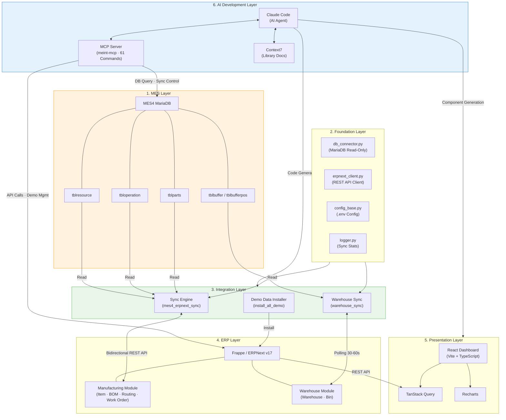
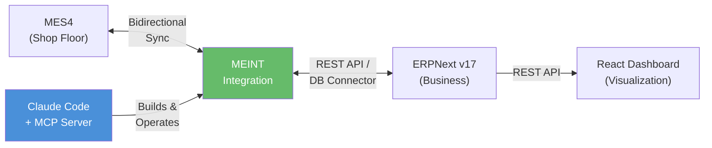
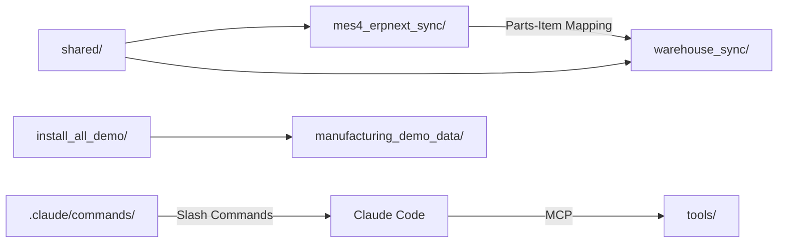

# MEINT 시스템 아키텍처

## 개요

MEINT(MES-ERP Integration)는 공장 현장의 MES4와 경영 관리의 ERPNext를 양방향으로 연결하는 제조 AX 프로젝트이다. 아키텍처는 **6개 계층 스택**으로 구성되며, 최하위 MES 계층부터 최상위 AI 개발 계층까지 데이터가 단계적으로 흐른다.

전통적인 5계층(MES → Foundation → Integration → ERP → Presentation)에 **AI 개발 계층**이 추가된 것이 MEINT의 핵심 차별점이다. 이 계층은 나머지 모든 계층의 코드, 컴포넌트, 문서를 생성하고 운영하는 **"만드는 계층"** 역할을 한다.

---

## 전체 아키텍처 다이어그램

---

## 계층별 구성 요소

### 1. MES 계층 (MES Layer)

Festo MES4의 MariaDB 데이터베이스가 위치하는 **최하위 계층**이다. 장비(Resource), 공정(Operation), 부품(Parts), 버퍼(Buffer) 등 공장 현장 데이터를 저장한다. MEINT에서는 **읽기 전용(Read-Only)** 접근을 기본 원칙으로 한다.

- **tblresource** — 장비/작업장 정보
- **tbloperation** — 제조 공정 정의
- **tblparts** — 부품/품목 마스터
- **tblbuffer / tblbufferpos** — 버퍼(임시 저장 공간) 및 위치별 재고

### 2. 기반 계층 (Foundation Layer)

모든 동기화 도구가 공유하는 **공통 모듈** 계층이다.

- **db_connector.py** — MES4 MariaDB 읽기 전용 커넥터 (Python Context Manager 패턴)
- **erpnext_client.py** — ERPNext REST API 클라이언트 래퍼
- **config_base.py** — `.env` 기반 환경 변수 설정 관리
- **logger.py** — 동기화 통계 추적 기능 포함 로거

### 3. 통합 계층 (Integration Layer)

MEINT의 **핵심 비즈니스 로직**이 위치하는 계층이다. 세 가지 주요 모듈로 구성된다.

- **Sync Engine (mes4_erpnext_sync)** — 7개 엔티티를 의존성 순서에 따라 양방향 동기화. JSON 파일 기반 ID 매핑, 스냅샷 기반 삭제 감지, 충돌 해결 메커니즘을 사용한다.
- **Warehouse Sync (warehouse_sync)** — MES4 버퍼 데이터를 ERPNext 창고에 동기화. 30~60초 주기 폴링 서비스와 온디맨드 즉시 동기화를 지원한다.
- **Demo Data Installer (install_all_demo)** — IoT 센서 모듈 제조 시나리오 데모 데이터를 ERPNext에 설치/삭제한다.

### 4. ERP 계층 (ERP Layer)

Frappe/ERPNext v17이 동작하는 계층이다. DocType 기반으로 REST API가 자동 생성되므로, `/api/resource/:doctype` 엔드포인트로 데이터에 접근할 수 있다.

- **Manufacturing Module** — Item, BOM, Routing, Work Order, Job Card
- **Warehouse Module** — Warehouse, Bin (재고 수량 관리)
- **기타** — Customer, Supplier, Purchase Order, Sales Order 등

### 5. 프레젠테이션 계층 (Presentation Layer)

React 18 기반 **제조 모니터링 대시보드**이다. ERPNext REST API에서 데이터를 가져와 시각화한다.

- **TanStack Query** — 서버 상태 관리, 캐싱, 자동 리페칭
- **Recharts** — 차트 렌더링 (OEE, 생산성, KPI 등)
- **Tailwind CSS + shadcn/ui** — 스타일링 및 UI 컴포넌트
- **Vite** — 빠른 HMR 지원 개발 서버 및 번들러

### 6. AI 개발 계층 (AI Development Layer)

MEINT의 AX 관점에서 **가장 중요한 계층**이다. 다른 모든 계층의 코드와 문서를 생성하고 운영한다.

- **Claude Code** — 자연어 지시로 코드 생성, 분석, 수정을 수행하는 AI 에이전트
- **meint-mcp** — 제조 도메인 전용 MCP 서버. MES4 DB 조회, ERPNext 데모 관리, 동기화 제어 등 61개 슬래시 명령 포함
- **Context7** — 외부 라이브러리(React, Frappe, ERPNext 등) 최신 공식 문서를 실시간 참조

---

## 데이터 흐름

데이터의 주된 흐름은 다음과 같다.

1. **MES4 → Integration** — MES4 MariaDB에서 장비, 공정, 부품, 버퍼 데이터를 읽기 전용으로 조회
2. **Integration ↔ ERPNext** — 마스터 데이터는 양방향 동기화, 재고 데이터는 MES4 → ERPNext 방향이 주된 흐름
3. **ERPNext → React Dashboard** — REST API(`/api/resource/:doctype`)를 통해 TanStack Query가 데이터를 페칭
4. **AI Development → All Layers** — Claude Code + MCP 서버가 전체 파이프라인을 설계, 구축, 운영

---

## 서비스 포트 구성

- **ERPNext Web** — 포트 8001 (HTTP)
- **Redis Cache** — 포트 13001 (TCP)
- **Redis Queue** — 포트 11001 (TCP)
- **Socket.io** — 포트 9001 (WebSocket)

> 기본 포트(8000, 6379 등)가 아닌 커스텀 포트를 사용하여 포트 충돌을 방지한다.

---

## 모듈 간 의존성

- **shared/** — 모든 동기화 도구의 기반 모듈 (DB 커넥터, REST 클라이언트, 설정, 로거)
- **mes4_erpnext_sync → warehouse_sync** — Parts-Item 매핑 결과를 재고 동기화가 참조
- **install_all_demo → manufacturing_demo_data** — JSON 데이터 파일을 읽어 ERPNext에 설치
- **.claude/commands/ → Claude Code → tools/** — 슬래시 명령이 AI를 통해 도구 코드를 생성하고 운영
