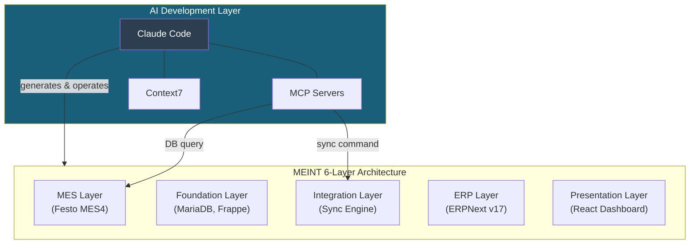
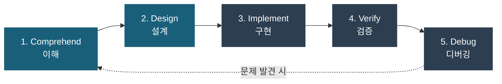

<!-- _class: lead -->
# AI Coding Tutorial — Overview

## Claude Code로 시작하는 AI 코딩

MEINT 프로젝트 사전 준비(Prerequisite)

---

# 이 슬라이드의 목적

### 두 가지 질문에 답하는 개요 문서

1. **AI 코딩이란 무엇인가?** — Claude Code를 중심으로
2. **왜 MEINT 실습 전에 배우는가?** — 도구 없이 프로젝트는 불가능하다

> MEINT 프로젝트의 **모든 실습**은 Claude Code를 통해 이루어진다
> 이 개요를 먼저 이해해야 이후 실습이 **왜 그렇게 진행되는지** 납득된다

---

# 목차

**Part 1 — WHY: 왜 AI 코딩인가**
- AI 시대의 코딩 방식 변화
- Claude Code = AI 코딩 비서
- MEINT에서 Claude Code가 하는 일

**Part 2 — WHAT: Claude Code 핵심 개념**
- 설치·인증·VSCode 연동
- CLAUDE.md와 권한 설정
- 기본 사용법과 MCP 서버

**Part 3 — HOW: AI 코딩 파이프라인**
- 5단계 워크플로우 개요
- MEINT 프로젝트와의 연결

---

<!-- _class: lead -->
# Part 1 — WHY

왜 AI 코딩인가

---

# 코딩 방식의 전환

### 전통적 개발

```
개발자가 직접:  코드 작성 → 디버깅 → 테스트 → 문서화
```

### AI 코딩 (Claude Code)

```
개발자가 지시:  의도 전달 → AI가 코드 생성 → 개발자가 검토·승인
```

**달라지는 것:**
- 코드를 "쓰는" 시간 → 코드를 "검토하고 지시하는" 시간
- 문법 암기 → **의도를 정확히 전달하는 프롬프트 능력**
- 혼자 작업 → **AI와의 협업** (제안 → 승인/반려)

> **비유:** 건축가(Architect)가 직접 벽돌을 쌓는 것에서
> **설계도를 그리고 시공팀에 지시하는 것**으로 역할이 바뀌는 것

---

# Claude Code = AI 코딩 비서

Anthropic이 만든 **AI 코딩 에이전트(Agent)**

```
┌──────────────────────────────────────────┐
│  You (Korean)                            │
│  "이 함수에 에러 처리를 추가해줘"           │
└──────────┬───────────────────────────────┘
           │  natural language
           ▼
┌──────────────────────────────────────────┐
│  Claude Code                             │
│  - reads code         - writes code      │
│  - runs tests         - searches docs    │
│  - manages git        - connects tools   │
└──────────┬───────────────────────────────┘
           │  code changes (diff)
           ▼
┌──────────────────────────────────────────┐
│  Your Project                            │
│  Accept / Reject each change             │
└──────────────────────────────────────────┘
```

> **비유:** 코드를 읽고 쓸 줄 아는 **AI 비서**에게 한국어로 업무를 지시하는 것

---

# Claude Code가 할 수 있는 일

### 핵심 능력 6가지

1. **코드 읽기** — 프로젝트 전체 구조를 파악하고 분석
2. **코드 쓰기** — 새 기능 구현, 버그 수정, 리팩토링
3. **테스트 실행** — pytest, jest 등 테스트 프레임워크 실행
4. **문서 검색** — 라이브러리 문서, API 레퍼런스 조회
5. **Git 관리** — 커밋, 브랜치, PR 생성
6. **외부 도구 연결** — MCP를 통해 DB, API 등에 접근

### 핵심 원칙: 사람이 최종 결정권자

AI가 제안하고 → **사람이 승인/거부**한다
모든 코드 변경은 **diff 뷰**로 확인 후 적용된다

---

# 왜 MEINT 실습 전에 배우나?

### MEINT 프로젝트의 모든 실습이 Claude Code를 통해 이루어진다

- **데모 데이터 설치** — `/erpnext-demo:setup-demo` 명령 실행
- **공장↔사무실 동기화** — `/mes4-erpnext:sync` 동기화 프로그램 실행
- **대시보드 만들기** — `/react-implement:implement-project` 코드 자동 생성
- **문서 작성** — `/rewrite-doc:slides` 슬라이드 자동 생성

### 도구를 모르면 프로젝트를 진행할 수 없다

```
도구(Claude Code)를 모름  →  실습 명령어를 이해 못함  →  프로젝트 진행 불가
도구(Claude Code)를 앎    →  AI에게 정확히 지시      →  프로젝트 원활히 진행
```

> **Introduction 슬라이드**에서 "AI가 무엇을 했는지"를 배웠다면,
> 이 튜토리얼에서는 **"AI를 어떻게 사용하는지"**를 배운다

---

# MEINT에서의 Claude Code 역할



> Claude Code + MCP Server가 MEINT의 **6개 계층 전체를 생성하고 운영**한다
> AI 도구를 배우는 것 = MEINT 프로젝트의 **작업 도구 전체를 배우는 것**

---

<!-- _class: lead -->
# Part 2 — WHAT

Claude Code 핵심 개념

---

# 설치와 인증

### 설치 (한 줄 명령)

```powershell
# Windows (PowerShell)
irm https://claude.ai/install.ps1 | iex

# Linux / macOS
curl -fsSL https://claude.ai/install.sh | bash
```

### 인증 (두 가지 방법)

- **브라우저 인증** (Pro/Max/Team) — `claude` 실행 → 브라우저 로그인 → 완료
- **API Key 인증** (Console) — `claude` 실행 → "Use an API key" 선택 → 키 입력

### 설치 확인

```bash
claude --version    # 버전 확인
claude doctor       # 설치·인증·네트워크·MCP 종합 진단
```

> Native Installer를 사용하면 **Node.js가 필요 없다**

---

# VSCode 연동

### 설치 (3단계)

1. VSCode에서 `Ctrl+Shift+X` → Extensions 패널
2. **"Claude Code"** 검색
3. **Anthropic** 게시자의 확장을 설치 (`anthropic.claude-code`)

### 열기 (3가지 방법)

- **Spark 아이콘** — 에디터 우측 상단 도구 모음의 반짝임(✦) 아이콘 클릭
- **상태바** — 하단 상태바의 Claude Code 항목 클릭
- **Command Palette** — `Ctrl+Shift+P` → "Claude Code" 입력

> 확장이 열리면 사이드바에 **Claude 채팅 패널**이 나타난다
> 여기에 자연어로 지시를 입력하면 AI가 코드를 읽고, 수정하고, 실행한다

---

# CLAUDE.md = AI의 취급설명서

프로젝트 루트에 위치하는 **AI 지침 파일**

```bash
/init    # 프로젝트 구조를 분석하여 CLAUDE.md 자동 생성
```

### CLAUDE.md에 담는 내용

- **기술 스택** — Python, React, ERPNext v17
- **빌드/실행 명령** — `bench start`, `npm run dev`
- **코딩 컨벤션** — 한국어 주석, Black 포매터 사용
- **프로젝트 구조** — `tools/` 동기화 도구, `apps/` ERPNext

> **비유:** 새 직원에게 주는 **"프로젝트 안내 가이드"**
> AI가 이걸 읽고 프로젝트의 맥락을 파악한다

---

# 권한 설정

### .claude/settings.json (팀 공유)

```json
{
  "permissions": {
    "allow": [
      "Read",
      "Bash(git *)",
      "Bash(npm run *)",
      "Bash(pytest *)"
    ],
    "deny": [
      "Read(./.env)",
      "Write(./production.config.*)"
    ]
  }
}
```

**규칙 평가 순서:** `deny` → `ask` → `allow` (deny가 항상 우선)

- **팀 설정** — `.claude/settings.json` (Git으로 공유)
- **개인 설정** — `.claude/settings.local.json` (`.gitignore`에 추가)

---

# 기본 사용법

### 자연어로 요청

```
> 이 프로젝트의 테스트를 실행해줘
```

### @로 특정 파일 참조

```
> @src/config.py 에서 DB 연결 부분을 리뷰해줘
> @src/main.py#10-25 이 부분의 에러 핸들링을 개선해줘
```

### 세 가지 권한 모드

- **Default** — 도구 사용 시마다 확인 요청 (일반 작업)
- **Plan** — 읽기만 허용, 쓰기 차단 (코드 분석·설계)
- **Auto-accept** — 모든 도구 사용 자동 승인 (신뢰할 수 있는 반복 작업)

> **비유:** AI가 수정안을 "제안"하고, 여러분이 **결재(승인/반려)** 하는 구조

---

# 자주 쓰는 슬래시 명령

- `/help` — 사용 가능한 명령어 표시
- `/clear` — 대화 컨텍스트 초기화
- `/compact` — 대화 기록 압축 (컨텍스트 절약)
- `/plan` — Plan 모드 진입 (읽기 전용)
- `/review` — 코드 리뷰 수행
- `/model` — 모델 전환 (sonnet, opus, haiku)

### 컨텍스트 관리

AI 대화가 길어지면 **컨텍스트 윈도우**(AI의 작업 기억)가 가득 찬다

- `/compact` = 책상 위 메모를 **요약 정리**하는 것
- `/clear` = 책상을 **완전히 치우고** 새로 시작하는 것

> `/compact` 후에는 에러 메시지와 스택 트레이스를 **다시 붙여넣어야** 한다
> 핵심 정보가 압축 과정에서 유실될 수 있기 때문

---

# MCP 서버 = AI의 팔과 다리

**Model Context Protocol** — AI가 외부 시스템(DB, API)에 접근하는 프로토콜

```
┌────────────────────┐     ┌────────────────────┐
│  Claude Code       │     │  MCP Server        │
│  (AI brain)        │────►│  (external tool)   │
│                    │◄────│                    │
└────────────────────┘     └─────────┬──────────┘
                                     │
                           ┌─────────▼──────────┐
                           │  DB / API / Files  │
                           └────────────────────┘
```

### MEINT의 MCP 서버 3종

- **meint-mcp** — 제조 전용 도구 (동기화, 데모 관리, BI) — 61개 명령
- **mariadb-mcp** — MES4 DB 직접 조회 (테이블 탐색, SQL 실행) — 5개 명령
- **context7** — 기술 문서 검색 (라이브러리 최신 문서 조회) — 2개 명령

> **비유:** Claude Code가 **두뇌**라면, MCP 서버는 **팔과 다리**
> 두뇌만으로는 물건을 집을 수 없듯, MCP가 있어야 외부 데이터에 접근한다

---

<!-- _class: lead -->
# Part 3 — HOW

AI 코딩 파이프라인

---

# 5단계 AI 코딩 파이프라인



### 핵심 구분: 읽기 vs 쓰기

- **이해·설계** → **Plan 모드** (읽기 전용, 코드 변경 없음)
- **구현·검증·디버깅** → **Default 모드** (코드 변경 가능)

> 이 파이프라인은 한 번에 끝나는 것이 아니라 **반복(iterate)** 된다
> MEINT의 모든 개발 작업에 이 5단계가 반복적으로 적용된다

---

# Stage 1~2: 이해와 설계 (Plan 모드)

### Stage 1: 코드 이해 (Comprehension)

기존 코드베이스를 파악하고 구조를 이해하는 단계

```
> 이 프로젝트의 전체 아키텍처를 설명해줘.
> 진입점, 주요 모듈간 의존 관계, 데이터 흐름을 정리해줘.
```

### Stage 2: 코드 설계 (Design)

새 기능의 구조를 **구현 전에** 설계하는 단계

```
> 새로운 MES4 엔티티 "ToolMaster" 동기화 매퍼를 추가하려고 해.
> 기존 PartMapper 패턴을 참고해서 설계안을 작성해줘.
```

> **핵심:** Plan 모드에서는 AI가 **코드를 변경하지 않는다**
> 설계를 먼저 보고 승인한 뒤 구현으로 넘어가면 재작업을 크게 줄일 수 있다

---

# Stage 3: 구현 (Default 모드)

설계를 기반으로 실제 코드를 작성하는 단계

```
> @lib/mes4_erpnext_sync/mappers/part_mapper.py 와 동일한 패턴으로
> ToolMasterMapper 클래스를 구현해줘.
```

### 구현 단계의 모범 사례

- **한 번에 하나의 모듈/기능만 요청** — AI의 응답 품질이 높아진다
- **diff를 꼼꼼히 확인 후 승인** — 불필요한 변경을 방지한다
- **`@` 참조로 기존 코드를 함께 전달** — 프로젝트 스타일을 일관성 있게 유지

> Claude가 코드를 수정하면 **diff 뷰**가 표시된다
> 각 변경을 확인하고 **Accept**(승인) 또는 **Reject**(거부)를 선택한다

---

# Stage 4~5: 검증과 디버깅 (Default 모드)

### Stage 4: 코드 검증 (Verification)

세 가지 방법으로 코드 품질을 확인한다:

- **코드 리뷰** (`/review`) — 논리 오류, 엣지 케이스, 스타일 점검
- **테스트 실행** (`pytest -v` 요청) — 기능이 올바르게 동작하는지 확인
- **테스트 작성** ("테스트를 작성해줘") — 아직 검증되지 않은 부분 커버

### Stage 5: 코드 디버깅 (Debugging)

- **에러 붙여넣기** — 에러 메시지를 프롬프트에 복사 (의사에게 증상 설명)
- **MCP 데이터 조회** — 실시간 DB 상태 확인 (환자의 검사 결과 확인)
- **Esc 되감기** — `Esc` 2회로 이전 시점 복원 (Ctrl+Z)

> **비유:** 에러 메시지는 "환자의 증상"이고, AI는 "의사" 역할을 한다
> 증상을 정확하게 전달할수록 진단이 빨라진다

---

# 파이프라인 요약

- **1. 이해** (Plan) — `@` 참조, `/plan` → "이 모듈의 구조를 분석해줘"
- **2. 설계** (Plan) — 설계안 제시 → "기존 패턴을 참고해서 설계안을 작성해줘"
- **3. 구현** (Default) — diff Accept/Reject → "동일한 패턴으로 구현해줘"
- **4. 검증** (Default) — `/review`, pytest → "테스트를 작성하고 실행해줘"
- **5. 디버깅** (Default) — 에러 분석, MCP → "이 에러를 분석하고 수정해줘"

```
이해 ──→ 설계 ──→ 구현 ──→ 검증 ──→ 디버깅
                                    │
                                    └──→ (문제 발견 시 이전 단계로)
```

> MEINT에서는 이 파이프라인을 **동기화 매퍼 개발, 대시보드 구현,
> 데모 데이터 설정** 등 모든 개발 작업에 반복 적용한다

---

# MEINT 프로젝트와의 연결

이 개요에서 배운 개념이 MEINT에서 **어떻게 활용되는지:**

- **`@` 파일 참조** → 동기화 코드 분석 시 매퍼 파일 참조
- **Plan 모드** → 새 동기화 엔티티 설계
- **diff Accept/Reject** → AI가 생성한 대시보드 코드 검토
- **`/review`** → 동기화 로직 코드 리뷰
- **pytest 실행** → 동기화/매퍼 단위 테스트
- **에러 붙여넣기** → MES4 DB 연결 오류 디버깅
- **MCP 서버** → 실시간 공장 DB 조회, 동기화 명령 실행

> 이 튜토리얼은 **"도구 사용법"**이고,
> MEINT 실습은 그 도구로 **"실제 문제를 해결하는 것"**이다

---

# 다음 단계: MEINT 학습 경로


여러분은 지금 **2단계를 완료**했습니다!

다음은 `/erpnext-demo:setup-demo` 명령으로 **데모 데이터를 설치**하고
실제 제조 업무 흐름을 체험합니다.

---

<!-- _class: lead -->
# Thank You

## AI Coding Tutorial — Overview
### Claude Code로 시작하는 AI 코딩

MEINT 프로젝트 사전 준비 완료!
