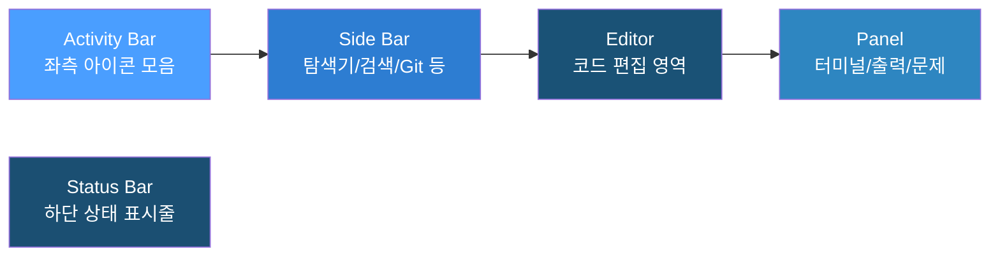

# VS Code 설치 및 기본 사용법

## 개요

Visual Studio Code(VS Code)는 Microsoft가 개발한 무료 코드 편집기다. 가볍고 빠르면서도 확장 기능을 통해 다양한 개발 환경을 지원한다. MEINT 프로젝트에서는 마크다운 문서 편집, Git 연동, 터미널 사용 등을 위해 활용한다.

**VS Code를 사용하는 이유:**

- **무료** — 개인/상업용 모두 무료
- **경량** — 설치 용량이 작고 실행 속도가 빠름
- **Git 통합** — 별도 도구 없이 Git 작업 가능
- **터미널 내장** — 편집기 안에서 바로 명령어 실행 가능
- **확장 기능** — 필요한 기능을 마켓플레이스에서 설치

---

## 1. 설치 방법 (Windows)

### Step 1: 다운로드

1. 브라우저에서 **https://code.visualstudio.com** 접속
2. **Download for Windows** 버튼 클릭
3. 설치 파일(`VSCodeUserSetup-x64-*.exe`)이 다운로드됨

### Step 2: 설치

1. 다운로드된 설치 파일 실행
2. 라이선스 동의 후 **다음** 클릭
3. 설치 옵션에서 다음 항목을 **체크 권장**:
   - **PATH에 추가** — 터미널에서 `code` 명령으로 실행 가능
   - **파일의 컨텍스트 메뉴에 "Code로 열기" 추가** — 우클릭 메뉴에서 바로 열기 가능
   - **디렉터리의 컨텍스트 메뉴에 "Code로 열기" 추가** — 폴더를 우클릭으로 열기 가능
4. **설치** 클릭 후 완료까지 대기

### Step 3: 최초 실행

1. 설치 완료 후 **VS Code 실행** 체크 → **마침**
2. Welcome 탭이 나타나면 정상 설치 완료
3. 한글 인터페이스가 필요하면 좌측 확장 아이콘 → `Korean Language Pack` 검색 → 설치 → 재시작

---

## 2. UI 구성 이해

VS Code 화면은 5개 영역으로 구성된다.



**각 영역 설명:**

- **Activity Bar** (좌측 세로 아이콘) — 탐색기, 검색, Git, 확장, 디버그 등 주요 기능 전환
- **Side Bar** (Activity Bar 옆) — 선택한 기능의 상세 내용 표시 (파일 목록, 검색 결과 등)
- **Editor** (중앙) — 파일을 열어 편집하는 핵심 영역. 탭으로 여러 파일을 동시에 열 수 있음
- **Panel** (하단) — 터미널, 출력, 문제 목록 등 보조 정보 표시
- **Status Bar** (최하단) — 현재 파일 정보, 인코딩, 줄/열 번호, Git 브랜치 표시

---

## 3. 기본 사용법

### 3-1. 파일/폴더 열기

**폴더 열기 (가장 많이 사용):**

1. **파일** → **폴더 열기** (또는 `Ctrl + K, Ctrl + O`)
2. 프로젝트 폴더 선택 → **폴더 선택** 클릭
3. Side Bar 탐색기에 폴더 구조가 표시됨

**파일 열기:**

1. **파일** → **파일 열기** (또는 `Ctrl + O`)
2. 또는 탐색기에서 파일을 클릭하여 열기

**터미널에서 열기:**

```bash
# 현재 폴더를 VS Code로 열기
code .

# 특정 파일 열기
code 파일이름.md
```

> `code` 명령이 동작하지 않으면 설치 시 PATH 추가 옵션을 놓친 것이다. VS Code에서 `Ctrl + Shift + P` → `Shell Command: Install 'code' command in PATH` 실행으로 해결한다.

### 3-2. 파일 생성/저장

**새 파일 생성:**

- 탐색기에서 폴더 위에 마우스 올리면 나타나는 **새 파일 아이콘** 클릭
- 또는 `Ctrl + N`으로 새 탭 생성 후 `Ctrl + S`로 저장 시 이름 지정

**저장:**

- `Ctrl + S` — 현재 파일 저장
- `Ctrl + Shift + S` — 다른 이름으로 저장

### 3-3. 편집 기본

**다중 커서:**

- `Alt + 클릭` — 클릭한 위치마다 커서 추가
- `Ctrl + Alt + ↑/↓` — 위/아래 줄에 커서 추가
- `Ctrl + D` — 현재 선택한 단어와 동일한 다음 단어를 선택에 추가

**줄 이동/복사:**

- `Alt + ↑/↓` — 현재 줄을 위/아래로 이동
- `Shift + Alt + ↑/↓` — 현재 줄을 위/아래로 복사

**줄 삭제:**

- `Ctrl + Shift + K` — 현재 줄 전체 삭제

**되돌리기/다시 실행:**

- `Ctrl + Z` — 되돌리기
- `Ctrl + Y` 또는 `Ctrl + Shift + Z` — 다시 실행

### 3-4. 검색 및 바꾸기

**현재 파일 내 검색:**

- `Ctrl + F` — 검색 바 열기
- `Ctrl + H` — 검색 + 바꾸기 바 열기

**전체 프로젝트 검색:**

- `Ctrl + Shift + F` — Side Bar에서 프로젝트 전체 검색
- `Ctrl + Shift + H` — 프로젝트 전체 검색 + 바꾸기

### 3-5. 터미널 사용

VS Code 내장 터미널로 별도 터미널 프로그램 없이 명령어를 실행할 수 있다.

**터미널 열기:**

- `` Ctrl + ` `` (백틱) — 터미널 패널 토글
- **터미널** → **새 터미널** — 새 터미널 탭 추가

**터미널 활용:**

- Git 명령어 실행 (`git add`, `git commit`, `git push` 등)
- Claude Code 실행 (`claude`)
- 프로젝트 빌드 및 실행

**터미널 분할:**

- 터미널 패널 우측 상단의 **분할** 아이콘 클릭으로 터미널을 나란히 배치 가능

---

## 4. 필수 단축키 정리

### 일반

- `Ctrl + Shift + P` — 명령 팔레트 열기 (모든 명령 검색/실행)
- `Ctrl + P` — 파일 빠르게 열기 (파일명 입력으로 검색)
- `Ctrl + ,` — 설정 열기
- `Ctrl + B` — Side Bar 토글

### 편집

- `Ctrl + X` — 줄 잘라내기 (선택 없이 실행하면 줄 전체)
- `Ctrl + C` — 줄 복사 (선택 없이 실행하면 줄 전체)
- `Ctrl + /` — 줄 주석 토글
- `Ctrl + ]` / `Ctrl + [` — 들여쓰기 / 내어쓰기
- `Ctrl + Shift + K` — 줄 삭제

### 탐색

- `Ctrl + G` — 특정 줄 번호로 이동
- `Ctrl + Tab` — 열린 파일 간 전환
- `Alt + ←/→` — 이전/다음 편집 위치로 이동

### 화면

- `Ctrl + =` / `Ctrl + -` — 확대 / 축소
- `Ctrl + \` — 편집기 분할
- `` Ctrl + ` `` — 터미널 토글

---

## 5. MEINT 프로젝트에서 권장하는 확장 기능

VS Code 좌측 Activity Bar의 **확장**(네모 아이콘) 클릭 후 검색하여 설치한다.

- **Korean Language Pack** — VS Code 메뉴를 한글로 변환
- **Markdown Preview Enhanced** — 마크다운 실시간 미리보기 (Mermaid 다이어그램 포함)
- **GitLens** — Git 이력을 코드 줄 단위로 확인 가능
- **Claude Code** — Claude Code 연동 (터미널에서 직접 사용해도 됨)

---

## 참고 자료

- [VS Code 공식 사이트](https://code.visualstudio.com)
- [VS Code 공식 문서](https://code.visualstudio.com/docs)
- [VS Code 단축키 치트시트 (Windows)](https://code.visualstudio.com/shortcuts/keyboard-shortcuts-windows.pdf)
