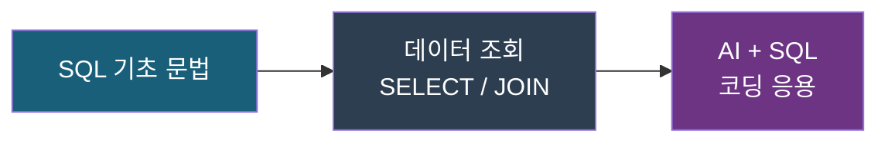
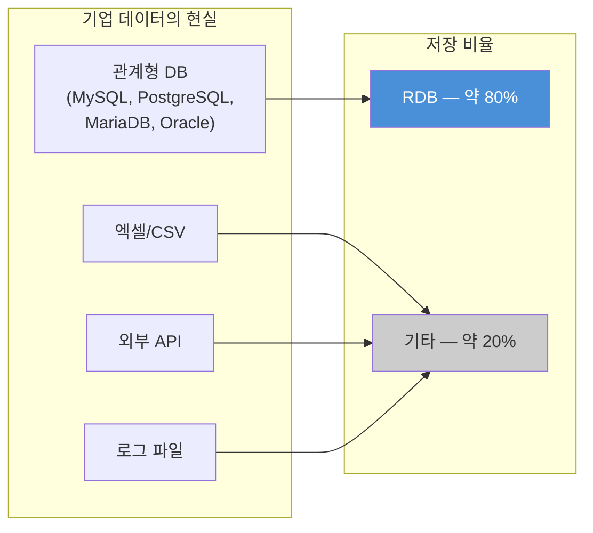
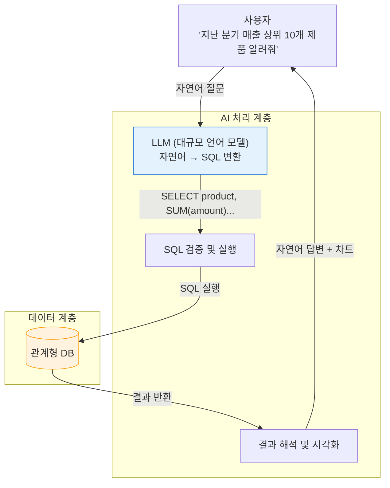
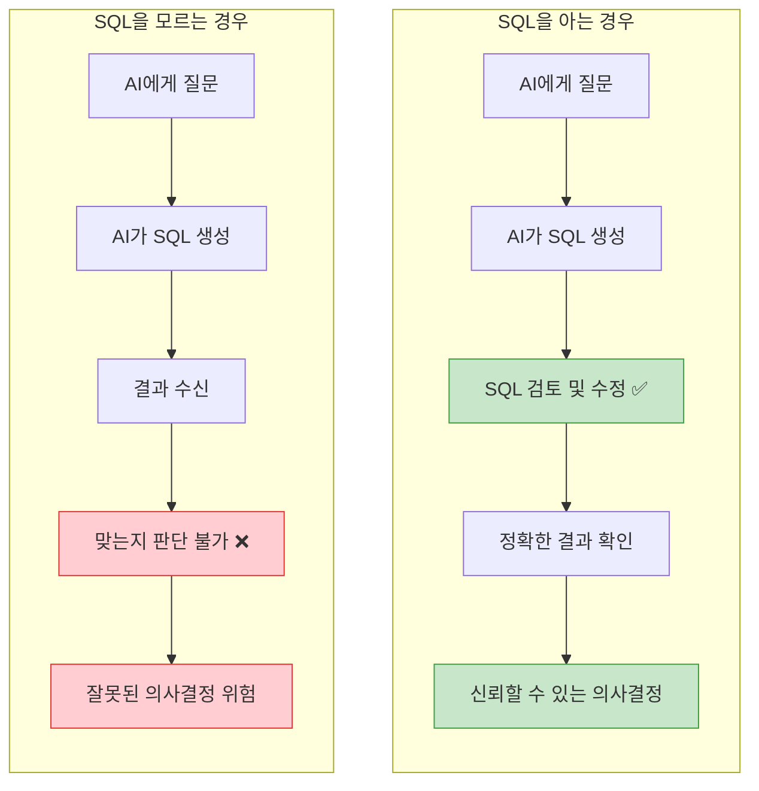
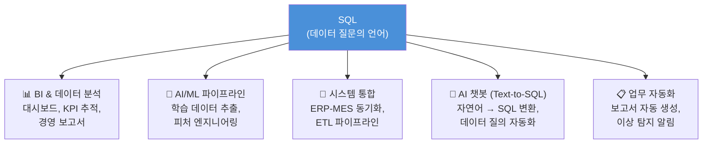
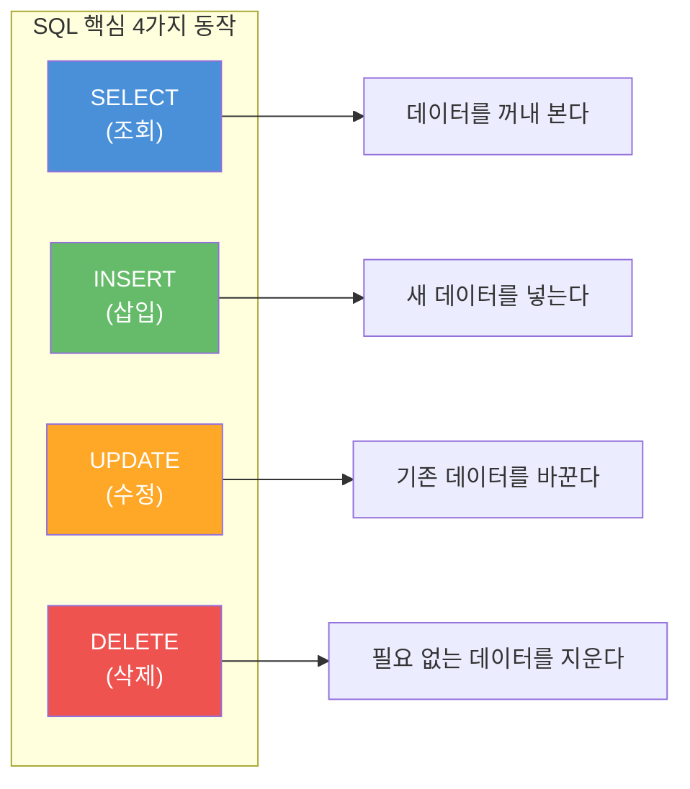
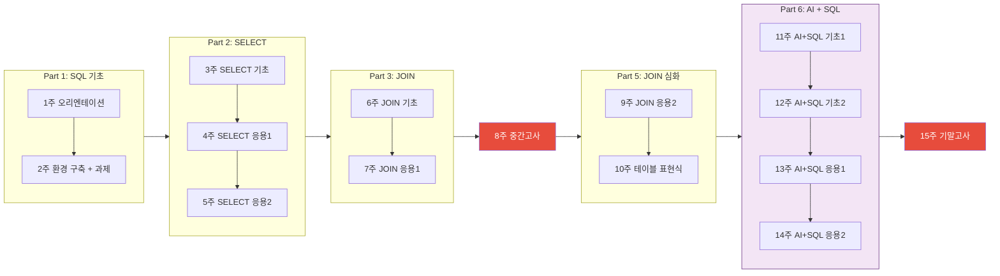
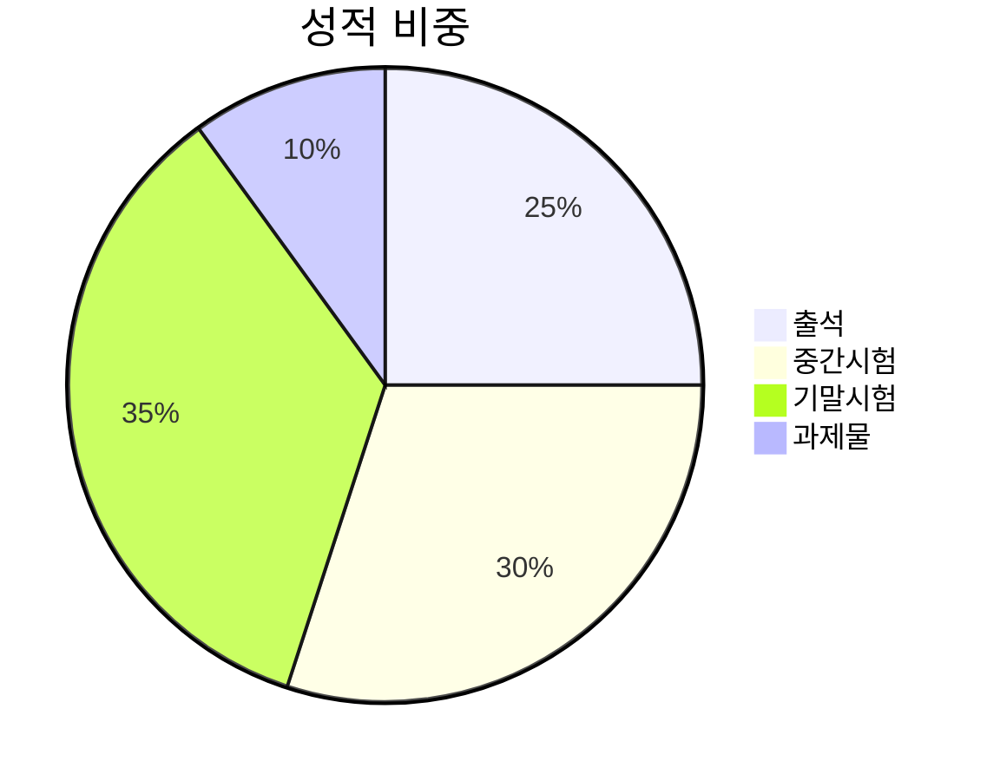

# 데이터베이스 언어 SQL 입문 소개

## 2026년도 1학기 | 수원대학교

---

## 1. 강의 소개

### 과목 정보

- **과목명** — 데이터베이스 언어 SQL 입문 (Introduction to SQL)
- **담당교수** — 장철 교수
- **학점** — 3학점
- **강의실** — 미래311
- **요일/시간** — 목요일 1, 2, 3교시
- **LMS** — CANVAS 사용

### 이 수업에서 배우는 것

데이터베이스의 표준 언어인 **SQL의 기초 개념과 문법**을 익히고, **생성형 AI 도구와 연계**하여 SQL을 활용하는 응용 기초 역량을 배양한다.



### 학습 목표

1. SQL 언어의 **기초 문법**을 이해한다
2. SQL 언어를 이용하여 **DB 기반 데이터 활용 프로그래밍** 기본 스킬을 습득한다

---

## 2. AI 시대에 SQL이 중요한 이유

### AI는 마법이 아니라 데이터 위에서 동작한다

AI 모델이 아무리 똑똑해도, 결국 **입력 데이터의 품질**이 출력을 결정한다. 그리고 기업의 핵심 데이터는 대부분 **관계형 데이터베이스(RDB)** 에 저장되어 있다.



- 기업 데이터의 약 80%는 관계형 데이터베이스에 있다
- AI에게 "매출 분석해줘"라고 말해도, **데이터가 어디에 어떻게 저장되어 있는지** 모르면 의미 있는 결과를 얻을 수 없다
- SQL은 이 데이터에 접근하는 **사실상의 표준 언어**이다

### AI 도구의 작동 원리: SQL은 어디에나 있다

최신 AI 도구들이 내부적으로 어떻게 동작하는지 살펴보면, SQL이 핵심 고리임을 알 수 있다.



**AI가 자연어를 SQL로 변환하는 실제 예시:**

- 자연어: _"지난 분기 매출 상위 10개 제품을 알려줘"_
- AI가 생성하는 SQL:

```sql
SELECT product_name, SUM(amount) AS total_sales
FROM sales
WHERE sale_date BETWEEN '2025-10-01' AND '2025-12-31'
GROUP BY product_name
ORDER BY total_sales DESC
LIMIT 10;
```

여기서 핵심 질문: **AI가 생성한 이 SQL이 맞는지, 틀렸는지 어떻게 판단하는가?**

### SQL을 모르면 생기는 문제



AI가 생성한 SQL에서 흔히 발생하는 오류:

- **잘못된 테이블/컬럼명** — AI가 존재하지 않는 컬럼을 사용
- **JOIN 조건 누락** — 테이블 간 관계를 잘못 연결하여 데이터 뻥튀기
- **필터 조건 오류** — 날짜 범위, 상태값 등의 조건이 비즈니스 의도와 불일치
- **집계 함수 오용** — COUNT vs SUM vs AVG를 잘못 선택

> **결론:** SQL을 이해해야 AI의 출력을 **검증**할 수 있다. 검증할 수 없는 결과는 신뢰할 수 없고, 신뢰할 수 없는 데이터로 내린 의사결정은 위험하다.

### AI 할루시네이션 — AI가 틀리는 근본 원인

AI가 SQL을 잘못 생성하는 것은 **할루시네이션(Hallucination)** 이라는 현상과 직결된다. AI 할루시네이션이란 AI가 **사실이 아닌 정보를 실제 사실처럼 생성**하는 현상이다. AI는 지식을 보유한 시스템이 아니라 **확률적으로 다음 단어를 예측하는 언어 모델**이기 때문에, 존재하지 않는 테이블명을 사용하거나 잘못된 JOIN 조건을 확신에 찬 코드로 작성할 수 있다.

**SQL 작업에서 나타나는 할루시네이션 유형:**

- **사실 오류** — 존재하지 않는 테이블이나 컬럼명을 사용
- **추론 오류** — 비즈니스 로직에 맞지 않는 집계나 필터 조건 생성
- **데이터 생성 오류** — 실제와 다른 데이터 구조를 가정하고 쿼리 작성

> AI가 자신 있게 작성한 SQL이라도 **틀릴 수 있다**는 전제 하에, 결과를 항상 검증하는 습관이 필요하다. 이것이 SQL 기초를 직접 배워야 하는 가장 중요한 이유이다.

### SQL이 활용되는 주요 영역



- **BI & 데이터 분석** — 매출, 생산, 품질 데이터를 SQL로 조회하여 대시보드 구성
- **AI/ML 파이프라인** — 모델 학습에 사용할 데이터를 SQL로 추출하고 전처리
- **시스템 통합** — 서로 다른 시스템(ERP, MES) 간 데이터를 SQL로 매핑하고 동기화
- **AI 챗봇 (Text-to-SQL)** — 사용자의 자연어 질문을 SQL로 변환하여 즉시 답변
- **업무 자동화** — 정기 보고서, 이상 탐지, 재고 알림 등을 SQL 기반으로 자동화

---

## 3. SQL의 핵심 4가지 — 이것만 알면 시작할 수 있다



이 중 실무에서 가장 많이 쓰는 것은 **SELECT(조회)** 이며, 이 과목에서 가장 비중 있게 다룬다.

**SELECT 하나로 할 수 있는 것:**

- 원하는 데이터만 골라 보기 (`WHERE`)
- 데이터를 그룹별로 집계하기 (`GROUP BY`)
- 여러 테이블을 연결하기 (`JOIN`)
- 결과를 정렬하기 (`ORDER BY`)
- 상위 N개만 추출하기 (`TOP`)

---

## 4. 수업 흐름 한눈에 보기



### Part별 학습 내용

- **Part 1 — SQL 기초 (1~2주):** 오리엔테이션, MS-SQL 서버 및 SSMS 설치, 데이터베이스 기본 개념
- **Part 2 — SELECT (3~5주):** SELECT 기본 문법, WHERE 조건 필터링, ORDER BY 정렬, GROUP BY 집계(COUNT, SUM, AVG)
- **Part 3 — JOIN (6~7주):** INNER JOIN, LEFT/RIGHT JOIN 기초, 여러 테이블을 연결하여 데이터 조회
- **Part 5 — JOIN 심화 (9~10주):** JOIN 응용 패턴, 서브쿼리, 테이블 표현식(CTE)
- **Part 6 — AI + SQL (11~14주):** 생성형 AI 도구로 SQL 작성, AI가 생성한 SQL 검증 및 수정 실습

> **최종 목표:** AI가 생성한 SQL을 **읽고, 검증하고, 수정**할 수 있는 역량을 확보한다.

---

## 5. 수업 운영 방식

### 강의 구성

- **강의 (60%)** — SQL 기본 개념, 원리, 기초 문법 중심의 이론 강의
- **예제 프로그래밍 (40%)** — SQL 예제 프로그램에 대한 설명을 듣고 직접 프로그래밍 해보기

---

## 6. 평가 방법

**상대평가**로 진행한다.

### 평가 항목별 비중

- **출석 (25%)** — 학교 규정에 의해 성적 처리에 반드시 포함됨
- **중간시험 (30%)** — 2주차~7주차 내용, 단답형/단문형/복문형 (Computer based Test)
- **기말시험 (35%)** — 2주차~14주차 내용, 단답형/단문형/복문형 (Computer based Test)
- **과제물 (10%)** — 개인 PC에 SQL 실습용 프로그램 설치 및 설치 증빙자료 제출



---

## 7. 사전 준비 사항

### 필수 준비물

- **Windows PC** — 수업용 프로그램이 윈도우 PC 설치 기준으로 진행됨
- **인터넷 환경** — 프로그램 다운로드 및 설치가 원활해야 함

### 필수 계정 (사전 가입)

다음 3개 계정을 **수강 전에 미리 가입**해 두어야 한다.

1. **ChatGPT 계정** — [chat.openai.com](https://chat.openai.com)
2. **Microsoft 계정** — [account.microsoft.com](https://account.microsoft.com)
3. **Google 계정** — [accounts.google.com](https://accounts.google.com)

### 수강 권장 대상

- 인터넷을 통해 설치 프로그램을 다운로드하고 Windows PC에 설치하는 등의 **PC 작업에 큰 어려움이 없는 분**
- IP주소 설정, 폴더/파일 경로 등 프로그램 설치 과정에서 나오는 메시지 등을 이해할 수 있는 분

> **2주차 과제 예고:** 수업에서 사용할 SQL 서버 프로그램(MS-SQL 서버, SSMS 등)을 개인 PC에 설치하고 **인증샷을 CANVAS에 제출**해야 한다. 1주차 수업 후 바로 준비하자.

---

## 요약

- AI 시대에 SQL의 가치는 줄어들지 않았다 — **오히려 더 중요해졌다**
- 기업 데이터의 대부분은 관계형 DB에 있고, SQL은 그 데이터에 접근하는 표준 언어이다
- AI가 SQL을 대신 써주지만, **검증 능력 없이는 신뢰할 수 없다**
- SQL을 이해하면 AI에게 **더 정확한 질문**을 하고, **더 나은 결과**를 얻을 수 있다
- SQL은 프로그래밍 언어 중 가장 배우기 쉽고, 가장 오래 살아남을 언어 중 하나이다
